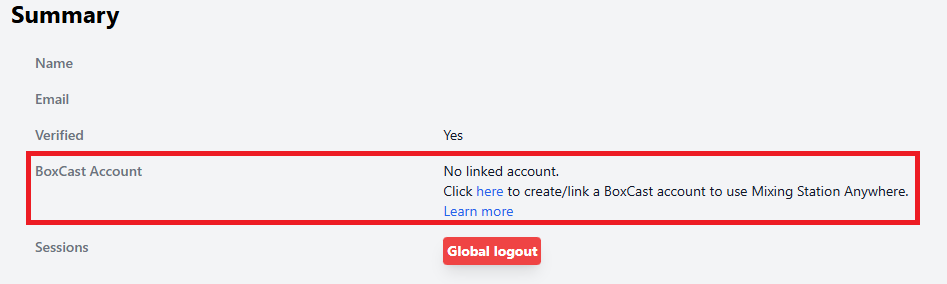
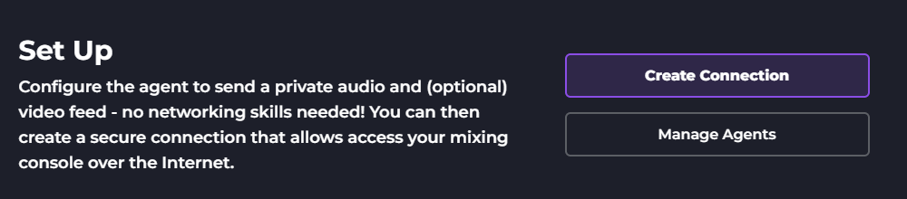
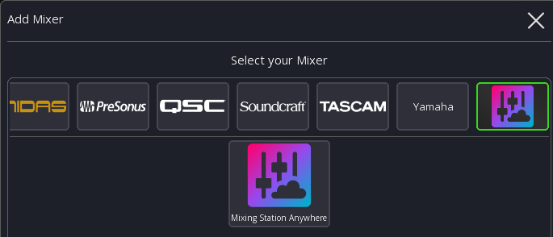

# Mixing Station Anywhere

## Overview

Mixing Station Anywhere allows you to remotely mix from anywhere via the internet.
This includes realtime audio and video and data streaming provided by BoxCast.

The system consists out of multiple components:

- Agent: Mixing Station Agent
- Clients: Mixing Station Web or Mixing Station App

### Agent: Mixing Station Agent

The agent is installed on-site and is responsible for streaming data, audio and video to the cloud system.

It can be installed on Windows or macOS.

### Clients

To mix remotely you have multiple clients to choose from:

#### Mixing Station Web

The web client is designed for ease of use and provides access to the basic mixing parameters.

#### Mixing Station App

You can also use the regular Mixing Station App as a client. This provides access to the same parameters
as if you would use Mixing Station locally.

## Requirements

To use Mixing Station Anywhere you'll need the following:

- A [Mixing Station Subscription](https://mixingstation.app/#download)
- A Windows or macOS System on-site in the same network as your digital audio mixer.
  The system also needs to be able to access the internet.

## Setup

1. Login to your [Mixing Station Account](https://mixingstation.app/profile) and click the "Link a BoxCast account": 
2. Once you've linked/created your BoxCast account, you can open the Mixing Station Web Dashboard to download the agent: https://dashboard.boxcast.com/mixing-station-web

   The direct download links can also be found at the bottom of this page.

3. Install the agent on the system that is in the same network as your mixer
4. You can configure the audio and video device that should be used to stream the audio/video preview. Usually this would be the audio mix that you're using for your stream.
5. Open the Mixing Station Web dashboard: https://dashboard.boxcast.com/mixing-station-web and click on "Create Connection":
   
6. Now you're ready to mix remotely, either using Mixing Station Web for Mixing Station App.

### Using Mixing Station App

1. Open Mixing Station
2. Click on `Add Mixer` and select the Mixing Station Anywhere icon: 
3. Assuming you already follow the setup guide, click on `Login`.
4. A browser window will open, login with your BoxCast account. Once authenticated this will bring you back to Mixing Station
5. Choose the agent/connection to connect to

## Known Limitations

- "Mixing Station App" as a client currently doesn't work with A&H dLive/Avantis/GLD/iLive mixers. A fix for the agent will soon be rolled out

## Agent Download Links

You can download the agent directly using the following download links:

- Windows: https://get.boxcast.com/remote-mix-software-agent/win32/x64/latest/Mixing%20Station%20Agent%20Setup.exe
- macOS (Apple Silicon): https://get.boxcast.com/remote-mix-software-agent/darwin/arm64/latest/Mixing%20Station%20Agent.dmg
- macOS (Intel): https://get.boxcast.com/remote-mix-software-agent/darwin/x64/latest/Mixing%20Station%20Agent.dmg