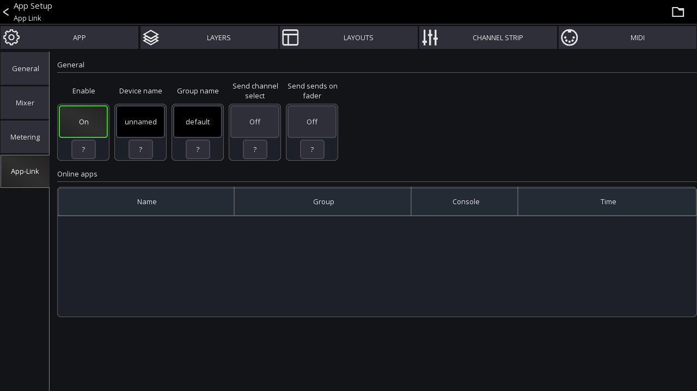

# App-Link
This feature allows you to use multiple devices for mixing and synchronize app parameters.

You could for example use two tablets where one shows the channel details and the other the mixer.
App-Link can synchronize the currently selected channel between those devices.

## Usage
1. Go to app settings
2. Select `App-Link`
3. `Enable` the feature on all devices you want to use this feature with

The table at the bottom shows all other devices found using App-Link

## Settings

### Enable
Enables the feature.

### Device Name
The `Device Name` indicates the name of the current device. It's used for easier identification.

### Group Name
You don't usually need to change this.

All devices having the same group name communicate with one another. 
If several groups of users want to use the App-Link feature independently on the same network, change the group name as required.

### Channel select
If enabled, the app sends the currently selected channel to other apps in the same group.

## Custom Layouts / Open view action
The `Open View` action can also use App-Link to open the view on another device.
To use this feature enable `Open via App-Link`.

