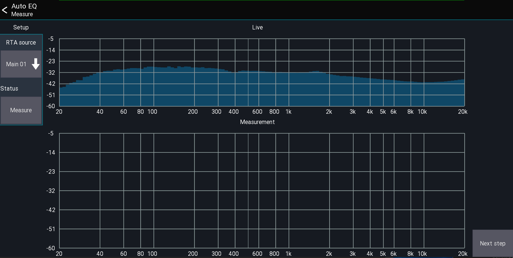
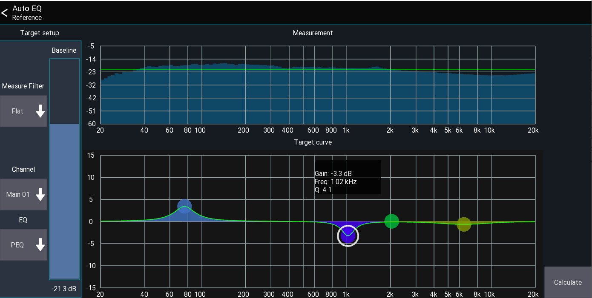
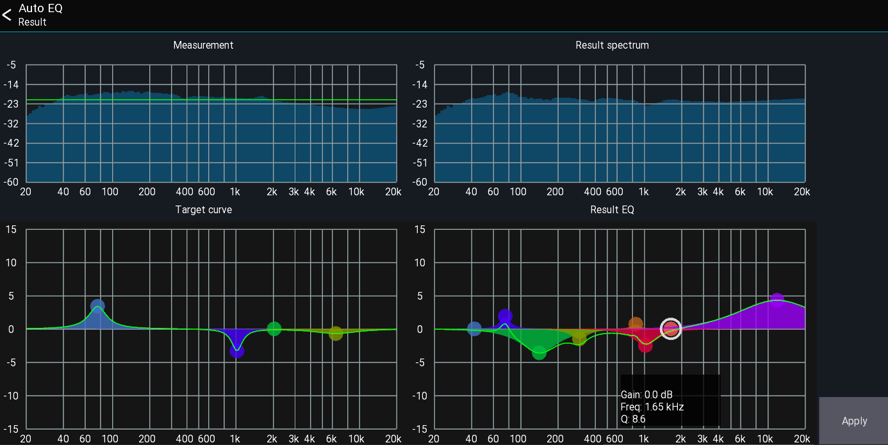

The auto eq feature is intended for automatically adjusting an EQ to
match a specified target curve. It is not designed to replace your ears! In the end you decide what sounds best.
It is just a tool, use it wisely.

Warning: This feature is still a work in progress

## Requirements
1. Measurement mic
2. Spare channel

## Usage
0. Make sure to disable / reset any EQ applied to the PA
1. Connect the measurement mic to a free channel.
2. Select `Auto EQ` from the main menu. This will open the "Measure" page.

3. Select the channel where the measurement mic it connected to. You should now see the RTA of the mic at the top of the screen
4. Start pink noise at roughtly the level you will be playing
5. Press `Measure`. The measurement will take ~3-5 seconds
6. Press `Next` to continue to the reference setup page
On this page you can configure how the system should be calibrated

7. Use the `Baseline` slider to adjust the green `0 dB` line. Everything below this line is assumed to be "too quiet", everything above "too loud".
8. Select the channel where the EQ should be applied, as well as the EQ which should be used. PEQ usually gives better results than GEQ.
9. The `Target curve` can be used to apply personal preferences to the calibration. If you want to have more bass for example, or more mids.
In this screenshot I want a bit more bass and a bit less 1kHz.
10. Press `Next` to calculate the resulting EQ.

12. The result will be shown at the bottom right. You can adjust this EQ before pressing `Apply` to apply the EQ to the channel
13. The top right shows an estimate of the the resulting spectrum.
In this example you can see that the app is trying to reduce the signal at 50-350HZ as it was above the green baseline. The highs gets boosted because they were below the baseline in the measurement.

Warning: This feature is still a work in progress