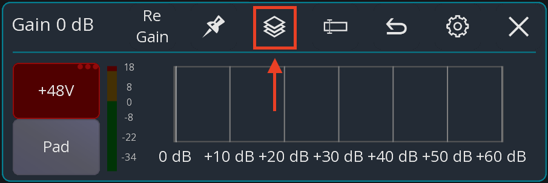
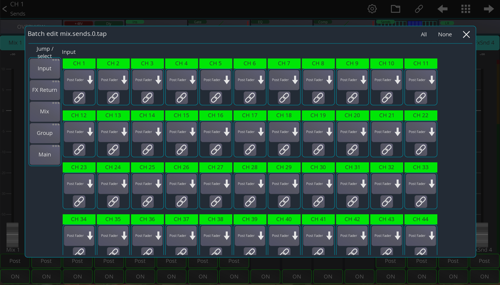

# Batch edit

Depending on your mixer, various parameters can be viewed and edited in bulk across channels. This applies to most settings accessible in the channel view and the channel strip.

Some example use cases:
- Toggling insert activation for a range of channels
- Changing send tap points for specific channel types
- Getting a quick overview of pan settings across all input channels
- Enabling or disabling dynamics processing for multiple channels at once

## Usage

There are two ways to access batch edit:
1. For on-off settings – Press and hold the corresponding button to open the batch edit window.
2. For continuous parameters – Open the parameter’s popup first. If batch editing is available, the batch edit window can be accessed via the following icon:

### Controls
The batch edit window consists of two main elements:
1. Main editing area – Displays the values being edited. Each channel/value combination includes a button to link edits.
2. Sidebar – Lists channel types for quick navigation and selection. Holding a channel type button toggles selection of all channels of that type.

### Behaviour
- On-off settings – Changes are **absolute**. If a setting differs across channels (e.g., PAD or HPF on/off), batch editing will apply a single uniform value to all selected channels.
- Continuous parameters – Changes are **relative**. Adjusting a value (e.g., gain) affects each channel proportionally rather than setting a fixed value.

