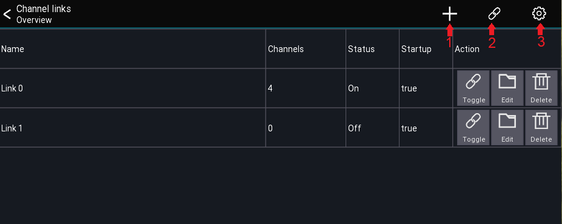
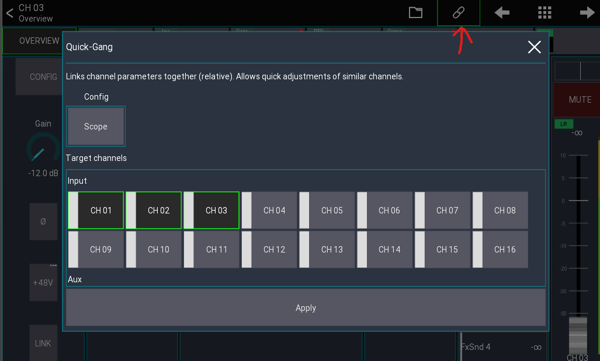
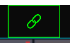

# Channel Links and Quick Gangs

Channel Links allows you to link together the values of multiple channels.
Quick-Gangs allows you to edit multiple channels relative to one another.

The following video provides a brief demonstration of the two features:

  <iframe width="650" height="400" src="https://www.youtube.com/embed/dLx8Jjchq7s" frameborder="0" allowfullscreen></iframe>

** Warning ** Using channel links on multiple Mixing Station instances at the same time may cause issues!
It is recommended to use this feature on one instance only.

## Channel Links

Open main menu -> `Channel Links` to open the Channel Links view.

#### Menu Items

1. Adds a new link group
2. Enables/Disables all link groups
3. Opens the settings dialog

#### Link table description

The link table columns are described below:

| Column   | Description                                                 | 
|----------|-------------------------------------------------------------|
| Name     | Name of the link group                                      |
| Channels | Number of channels included                                 |
| Status   | Shows if the link is currently active                       |
| Startup  | Indicates if the link group is enabled when opening the app |

All channel links are stored automatically for the current mixer model.
When connecting to a mixer, all links are disabled by default. This can be changed in the settings.

### Creating links

1. Press the `+` icon to add a new link group
2. Select the channels you want to link
3. Press the `Scope` button to adjust which parameters to link

### Settings

The `Apply after connect` setting determines if the links marked with `Startup: true` should be enabled automatically
after
connecting to a mixer.

## Quick-Gang

This feature allows you to quickly edit multiple channels at the same time.
The difference between quick-gang and channel links is that quick-gang links all parameters relative to each other.

An example use case would be to adjust the gain of all drum channels by a certain amount - for example when the drummer
suddenly plays louder than during soundcheck.

You can access this feature via the chain icon in the top menu of any channel view as shown below.

Simply select the channels you want to gang together and hit `Apply`.
A green icon indicates an active gang: 

Press the icon again to disable the gang.
