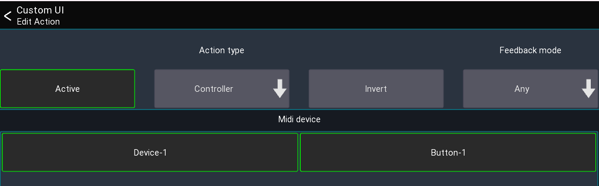

# Actions

Actions are used to assign a parameter or app function to a custom ui element or midi controller.

## Action settings

When editing an action, you'll see the following view

This view can be separated into two section:
The top section is equal across all actions and configures which action should be used, and how it should behave
while the bottom section contains the action specific settings.

### Active

Defines if this action is currently active. This is useful if you want to have a single midi button/knob to control
different things. Disabling an action means it won't do anything anymore. It's usually used in conjunction with
the `Midi actions` (see below).

### Invert

When enabled, the values of the action will be inverted. This might be useful if you want an `on` instead of `mute`
button.

### Feedback mode

This is only available for actions which refer to on/off values. If defines under which conditions the action should
notify
the UI element/Midi controller about value changes. Changing this value might only be required for very specific use
cases.

## Action types

Depending on the current mixer model, more or less action types are available.

The following describes all Action types available.

### App actions

App actions change app related parameters or provide access to data like the current time.
Here are some examples of the use cases for app actions:

- Change selected channel/peq band/layer/sends on fader
- Change mute/fine fader mode
- Open another view or layout
- Current date/time

#### Open view / open layout

These actions open another view/layout.

**Note:** If you have multiple actions assigned no other actions in the list will be executed after this action.
If you want for example change a layer and open a view with one button press place the "open view" action last.

### Channel actions

Channel actions change parameters related to a channel (for example a mute button or a fader value).

- Bus master channel: Parameter of the current bus master channel
- Current channel: Parameter of the currently selected channel
- Current layer: Parameter of a channel in the currently selected layer
- Fixed channel: Parameter of a fixed channel
- Fixed layer: Parameter of a channel in a fixed layer

The `Use SoF` button changes how the value should behave in regard to the currently selected sends on fader mix:
When activated, the `Fader`, `Pan`, and `On` values will be affected by sends on fader. When disabled, these values will
always affect the main mix only.

### Console actions

Console actions provide access to mixer parameters other than channels.
Depending on the mixer model, more or less parameters might be available:

- Audio player access (if supported by the mixer)
- Automix
- Clear solo
- FX parameters
- Mutegroups
- Monitor settings
- Routing
- Show control
- Talkback

### Midi actions

These actions allow you to change the midi mapping or send our midi values to other devices.

Since these actions might be more complex to understand, they will be explained in the following in more detail:

#### Action swap

This actions changes the `Active` state of another action assigned to a midi controller.

Example:
Assuming you want to have a midi knob which should act either as pan or as gain knob and switching between those two
modes should be done using another button.

To archive this you would first assign both actions to your knob, but only keep one action active

1. CH Pan [Active]
2. CH Gain [Active disabled]

In order to switch between those two actions, you now would assign the `Action swap` action to a button
and configure it to swap to the `CH Gain` action:

Pressing the button would now change the knob between Pan or Gain.

#### Batch action swap

Same as the `Action swap` action, but changes the action of multiple midi controllers at the same time.
This can be used for example to swap the actions all knobs.
The `Controller name (prefix)` field defines the prefix of the name of the midi controllers that should be changed.

Using the same example from above:
Assuming our midi knobs are all called `Knob-1`, `Knob-2`, .. in mixing station, we can now enter
`Knob-` as prefix in the text field, and select `Action 1` to swap the active action of all knobs to the 2. action.

#### Controller

This action allows you to send midi data to other devices.
This can be either simple note/cc events triggered via a button, or fader and knobs sending absolute midi values.

To use this action you first need to create a midi device in mixing station and create a midi controller.

Example:
Assuming you want to create a button that sends out a Midi Note On 5 event when you press it.

1. Create midi device
2. Create midi controller with the midi event set to `Note on` and Note to `5`
3. Add a button to your custom layout, assign the `Midi Controller` action to it
4. Select the previously created midi controller for this action

#### Dummy

This action does nothing. It can be used to fill up an action slot of a button/knob in conjunction with
the `Batch action swap` action.

#### Label ref

This action returns the label of the currently active action of a midi controller.
It is used for MCU midi devices to show the current knob value on the LCD.

#### Scroll layer

This action moves all channels in the current layer to the left/right. Can only be used by midi controllers directly.

Example:
Your current layer has 12 channels but your midi device only has 8 faders.
You can use this action to scroll inside the current layer to access all 12 channels.

## Label tags

It is possible to use dynamic text as a label for UI items.
To do so, use one of the following tags:

| Tag            | Action               | Description                                 |
|----------------|----------------------|---------------------------------------------|
| `[label]`      | Any                  | Shows a short description of the action     |
| `[value]`      | Any                  | Shows the current value of the action       |
| `[bpm]`        | FX                   | BPM for 1/4 notes                           |
| `[sofname]`    | Sends on fader       | Name of the current bus master              |
| `[shortLabel]` | Channel actions      | Short version of label                      |
| `[chname]`     | Channel actions      | Current name of the channel                 |
| `[chnum]`      | Channel actions      | Channel type + name (e.g. `Mix 01`)         |
| `[sendName]`   | Channel send actions | Name of the channel send used by the action |
| `[fx]`         | FX actions           | Name of the FX type                         |
| `[varname]`    | FX actions           | Name of FX parameter                        |
