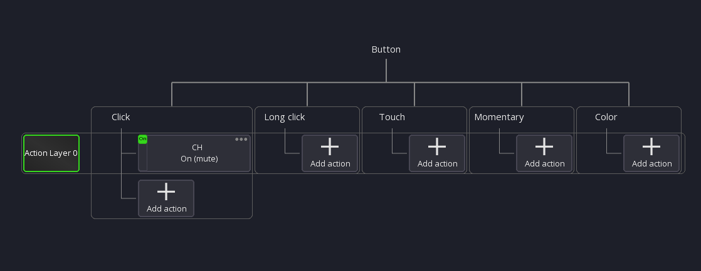
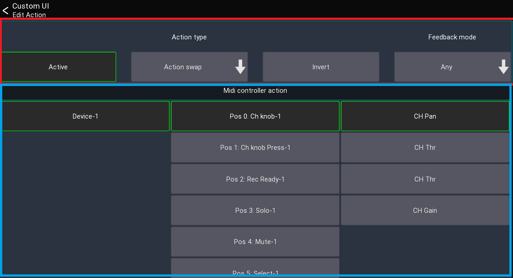
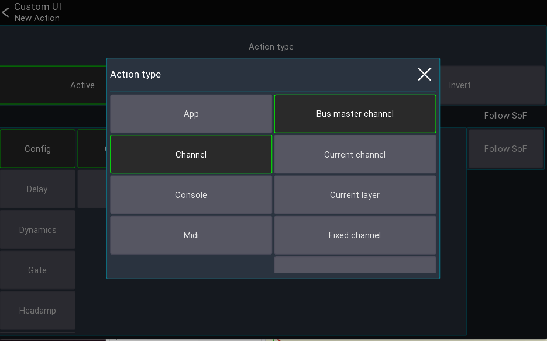
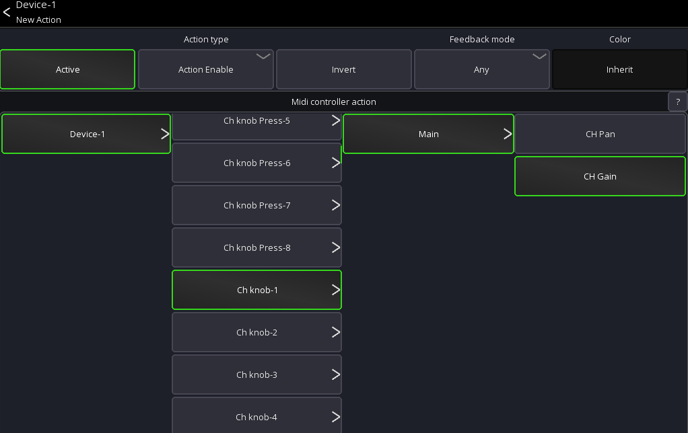
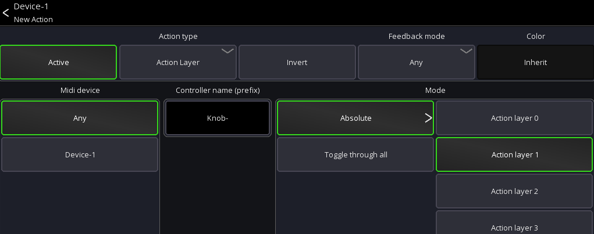

# Actions

Actions are used to assign parameters to custom UI elements or midi controls.

They defined how and what parameter should be controlled.

To edit an action you need to either edit a custom UI element, or a midi control.
It is recommended to read those pages first.

## General Operation

Each UI element / midi control has one or more slots where actions can be added to.

The follow screenshot shows all slots available:

Each slot gets used for a different purpose. In this example the button has different slots ("Click", "Long Click", "
Color", ...).

As the name implies, the actions in those slots are executed on "Click", "Long Click" or provide a color
to the button.

All actions in the same row belong to the same group called "Action Layer".

An "Action Layer" can be used to quickly change what actions are "Active". This will be handled in more detail below.

## Action settings

When editing an action, you'll see the following view

In the top section you can change the action type and general config, while
in the bottom section you configure the settings for the currently selected `Action Type`.

### "Active" Button

Defines if this action is currently active. This is useful if you want to have a single button/knob to control
different things. Disabling an action means it won't do anything anymore. It's usually used in conjunction with
the `Midi actions` (see below).

### "Invert" Button

When enabled, the values of the action will be inverted. This might be useful if you want an `on` instead of `mute`
button.

### Feedback mode

This is only available for actions which refer to on/off values. If defines under which conditions the action should
notify the UI element/midi control about value changes. Changing this value might only be required for very specific use
cases.

### Color

Each action emits a color, by default this color is depending on the parameter controlled by the action. 

For example channel related actions will emit the color of the channel.

You can this behavior and select a fixed color instead by pressing this entry.

The color emitted by an action can be consumed multiple ways:

- Midi devices supporting color
- UI elements in custom layouts

## Action type

Depending on the mixer model, more or less action types are available.

The following describes all action types available:

### App actions

App actions change app related parameters or provide access to data like the current time.
Here are some examples of the use cases for app actions:

- Change selected channel/peq band/layer/sends on fader
- Change mute/fine fader mode
- Open another view or layout
- Current date/time

#### Open view / open layout

These actions open another view/layout.

**Note:** If you have multiple actions assigned no other actions in the list will be executed after this action.
If you want for example change a layer and open a view with one button press place the "open view" action last.

### Channel actions

Channel actions change parameters related to a channel (for example a mute button or a fader value).

- Bus master channel: Parameter of the current bus master channel
- Current channel: Parameter of the currently selected channel
- Current layer: Parameter of a channel in the currently selected layer
- Fixed channel: Parameter of a fixed channel
- Fixed layer: Parameter of a channel in a fixed layer

The `Use SoF` button changes how the value should behave in regard to the currently selected sends on fader mix:
When activated, the `Fader`, `Pan`, and `On` values will be affected by sends on fader. When disabled, these values will
always affect the main mix only.

### Console actions

Console actions provide access to mixer parameters other than channels.
Depending on the mixer model, more or less parameters might be available:

- Audio player access (if supported by the mixer)
- Automix
- Clear solo
- FX parameters
- Mutegroups
- Monitor settings
- Routing
- Show control
- Talkback

### Midi actions

These actions allow you to change the `Active` state of actions assigned to midi controls, or send our midi values.

Therefore, those are only relevant for midi devices.

Since these actions might be more complex to understand, they will be explained in the following in more detail:

#### Action Enable

This actions changes the `Active` state of another action assigned to a midi control.

Example:
Assuming you want to have a midi knob which should act either as pan or as gain knob and switching between those two
modes should be done using another button.

To archive this you would first assign both actions to your knob, but only keep one action active

1. CH Pan [Active]
2. CH Gain [Non-Active]

In order to switch between those two actions, you now would assign the `Action Enable` action to a button
and configure it to swap to the `CH Gain` action:

Pressing the button would now change the midi knob between Pan or Gain.

#### Action Layer

Same as the `Action Enable` action, but changes the action of multiple midi controls at the same time.
This can be used for example to swap the actions all knobs, faders, etc.

The `Control name (prefix)` field defines what midi controls should be changed. All controls having
the same prefix in their name will be changed.

Using the same example from above:
Assuming our midi knobs are all called `Knob-1`, `Knob-2`, ... in mixing station, we can now enter
`Knob-` as prefix in the text field, and select `Action 1` to swap the active action of all knobs to the 2. action.

You can also use the `Toggle through all` option which will toggle through the active actions of the matching midi
controls
instead of enabling a fixed position.

#### Send/Receive

This action allows you to trigger midi commands of already defined midi controls.
This can be either simple note/cc events triggered via a button, or fader and knobs sending absolute midi values.

To use this action you first need to create a midi device in mixing station and create a midi control.

Example:
Assuming you want to create a button that sends out a Midi "Note On 5" event when you press it.

1. Create midi device
2. Create midi control with the midi event set to `Note on` and Note to `5`
3. Add a button to your custom layout, assign the `Midi->Send/Receive` action to it
4. Select the previously created midi control for this action

#### Dummy

This action does nothing. It can be used to fill up an action layer in conjunction with the `Action Layer` action.

#### Action ref

This action references to another action of another midi control.

This can be for example used on midi devices with LCDs to show the value of the knobs.

#### Scroll layer

This action moves all channels in the current layer to the left/right. Can only be used by a midi control.

Example:
Your current layer has 12 channels but your midi device only has 8 faders.
You can use this action to scroll inside the current layer to access all 12 channels.

## Label tags

It is possible to use dynamic text as a label for UI items.
To do so, use one of the following tags:

| Tag            | Action               | Description                                 |
|----------------|----------------------|---------------------------------------------|
| `[label]`      | Any                  | Shows a short description of the action     |
| `[value]`      | Any                  | Shows the current value of the action       |
| `[bpm]`        | FX                   | BPM for 1/4 notes                           |
| `[sofname]`    | Sends on fader       | Name of the current bus master              |
| `[shortLabel]` | Channel actions      | Short version of label                      |
| `[chname]`     | Channel actions      | Current name of the channel                 |
| `[chnum]`      | Channel actions      | Channel type + name (e.g. `Mix 01`)         |
| `[chnumShort]` | Channel actions      | Channel index (e.g. `1`)                    |
| `[sendName]`   | Channel send actions | Name of the channel send used by the action |
| `[fx]`         | FX actions           | Name of the FX type                         |
| `[varname]`    | FX actions           | Name of FX parameter                        |
