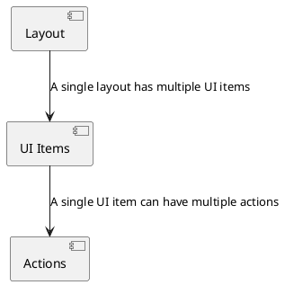
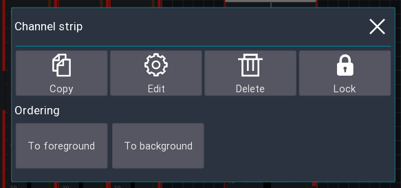
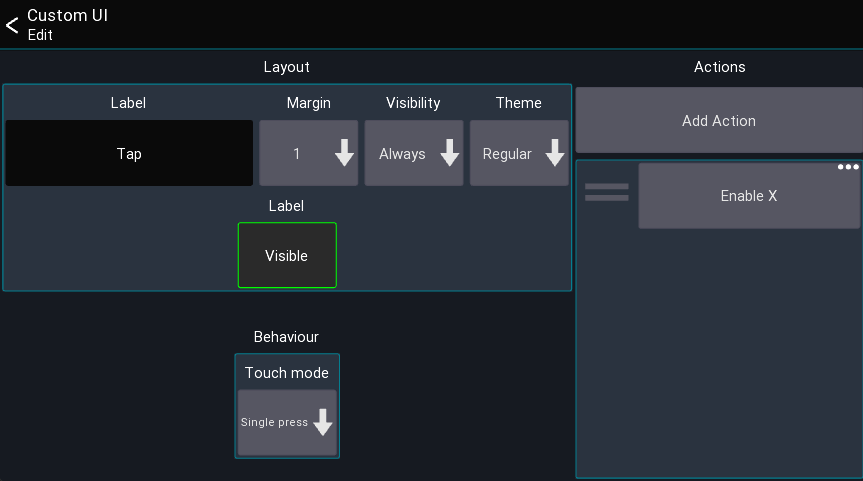
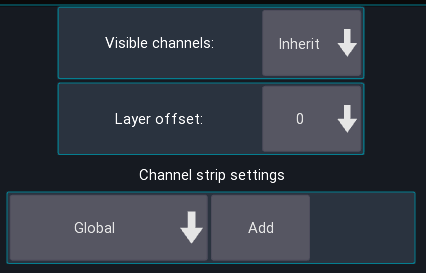
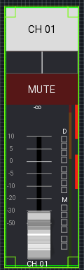
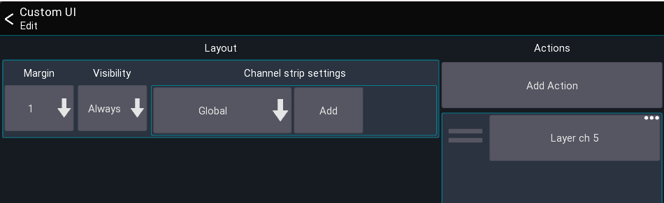

# Custom layout

This feature allows you to fully customize the mixer view to match your workflow
and create new views for many different purposes (e.g. fixed installations).

This view shows you all layouts currently loaded from your settings.

## Behaviors

A layout can be configured to have different behaviors, which are also indicated in the `Mixer` and `Startup` column
above.

- `Override mixer layout`: A layout with this flag will replace the default mixer layout of the app.
- `Open on start`: The layout will be opened directly after connecting to your mixer. You'll be able to press the back
  button to return to the mixer view.
- `Default`: The layout must be opened manually using a button or via the table shown above.

## Terminology

- UI item: Buttons, Knobs, Channel strips, ...
- Action: An action defines what an UI element should be controlling (for example Mute, Fader level, ect)

The following describes how layouts, UI items and actions correlate to each-other.

## Quickstart

1. Open the menu of the main view
2. `Menu -> Setup -> Layouts`
3. Press the `+` menu entry to add a new layout
4. Add and move UI items to your taste

> By default, the first custom layout you create will override the mixer layout.

If you want to go back to the app's default, simply delete your layout.

## Using the layout editor

This section describes how to use the layout editor.

### Moving and resizing

By default, you can simply drag items to move them to another position.
To resize an item, simply drag them from one of their edges, as indicated by the
green rectangle in each edge.

Sometimes it's hard to move or resize small items, in this case you can press the top
`Size + Move` menu button, which will change the modes of the editor.

The following describes the available modes

| Mode        |     | Description                                                                    |
|-------------|:----|--------------------------------------------------------------------------------|
| Size + Move |     | Items can be moved and resized, depending on where they are touched (default). |
| Resize      |     | Dragging an item causes it to be resized.                                      |
| Move        |     | Dragging an item causes it be moved.                                           |   

### Adding new items

New items can be added via the `+` symbol in the top menu.

### Editing an item

In order to further configure an item simply click on it (without moving it).
A dialog will appear with further options:

#### Copy

Add the element to the clipboard. You can paste it using the clipboard button in the top menu.

#### Edit

Allows you to edit the actions of the UI item (aka what should be controlled by the item), as well as
other options such as coloring, margin, labels, ect.
More information about this can be found below.

#### Delete

Removes the item from the layout

#### Lock

Enabling the lock will make it impossible the move/resize the item anymore.
To disable the lock, simply click on the item again to open this dialog.

#### Ordering

The two `to fore/background` buttons change the order in which the UI items are shown on the screen.
This might be useful for example if you want to move a background item behind other items.

### Layout Settings

While in the layout editor, press the `gear icon` in the top menu to open the layout settings as shown below.

Here you can rename your layout, or change the general behaviour.

#### Name

The name that should be used for this layout

#### Behaviour

See section `Behaviors`.
The `Open on startup` option is designed for scenarios where you want to limit the accessible parameters (the top menu
is empty).
Additionally, it's possible to **password protect** the ability to return to the main mixer.

This allows you to create a dedicated layout (for example for a wall mounted tablet) and completely restrict access to
anything else in the app.

#### Orientations

For advanced use-cases it's possible to have separate layouts for portrait and landscape mode.
Usually `Combined` is fine.

#### Top Menu

Indicates if the top menu should be shown. This is only relevant for layouts not using the `override mixer layout`
behavior.

#### Password on exit

Enable to prompt the user for a password before allowing to exit the layout.
This can be used for fixed installation purposes where the regular user should only
have access to pre-defined layouts, and only certain people should be allowed to access the rest
of the app.

This is only relevant for layouts not using the `override mixer layout` behavior.

## UI Settings

This section describes the settings available for the UI elements (aka when pressing the `Edit` button).

### Label
The label is the text that should be shown on the UI element.
You can use action tags to build labels that change based on the current value, for example:
`[label] [value]`.
All available tags can be found on the [actions page](custom-actions.md#label-tags).

### Margin
Defines how big the margin should be of the UI element

### Visibility

This setting controls the conditions under which the UI is visible.

| Visibility | Description                               |
|------------|-------------------------------------------|
| Always     | Item is always visible                    |
| Only SoF   | Item is only visible if SoF is active     |
| Not SoF    | Item is only visible if SoF is not active |

### Actions
This list shows all actions assigned to the UI element. Click on an entry to open the action,
 press and hold an entry to remove it.
See [actions page](custom-actions.md#label-tags) for more details.

Note: Some UI elements may have more or less settings, these are described below.

## UI items

This section describes all available UI items and their special configuration parameters.

--- 

### Mixer

Shows all channels of the currently active layer.
This also includes the meterbridge (if enabled in the app settings).

#### Visible channels
Defines how many channels should be shown, by default it uses the value of your layer settings.

### Layer offset
Changes which layer is currently shown, relative to the currently selected layer. 
You can use this to build up rows of mixer elements, each showing a different layer. 

### Channel strip settings
Defines how the channel strips should look. By default, the [global settings](settings/channel-strip.md) are used.

--- 

### Channel strip
Shows a single channel strip that can be assigned to a fixed, or dynamic channel (for example the current bus master).

Similar to the mixer element, the look of this item can also be configured to be independent of the global channel strip settings.

--- 

### Sidebar

List of buttons for controlling the sends on fader, fine and mute enable status.

--- 

### Sends on fader buttons

List of buttons for controlling the sends on fader state

--- 

### Layer list

List of buttons for selecting a layer.

--- 

### Button

A button can be used to toggle the status of an action.

#### Settings: Touch mode

It is possible to change the touch behaviour of the button.
This can be useful, for example, when you want to control a mute group via a long press only.

--- 

### Knob

A knob can be used to control a numeric value (like a send level or pan).

--- 

### Label

A label can be used to show values like the current scene, or just to display text.

#### Settings: Text position

Changes how the text is aligned on screen.

