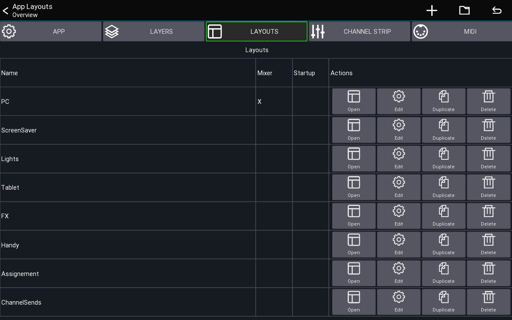
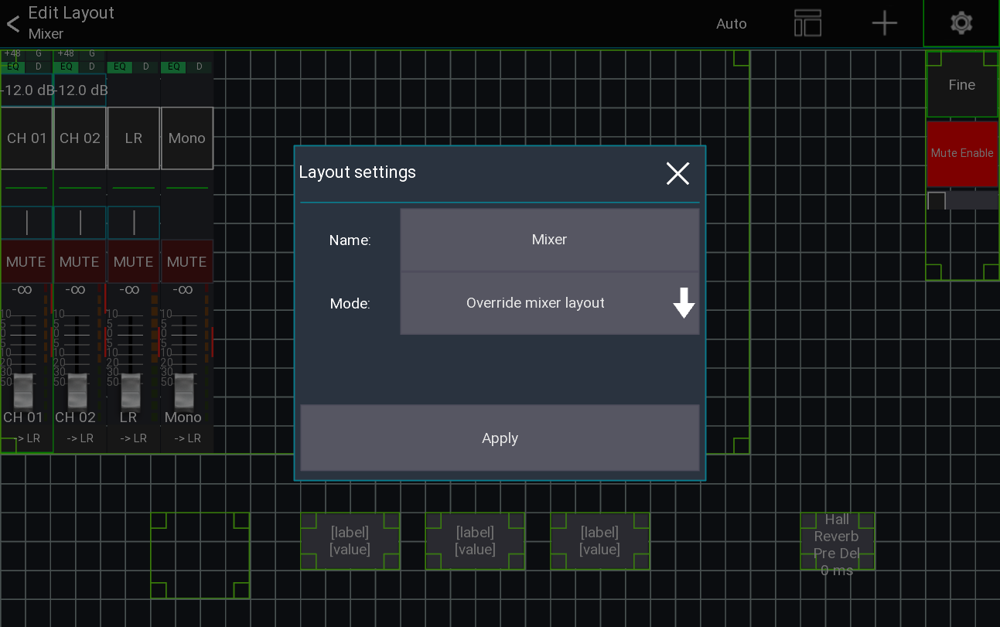
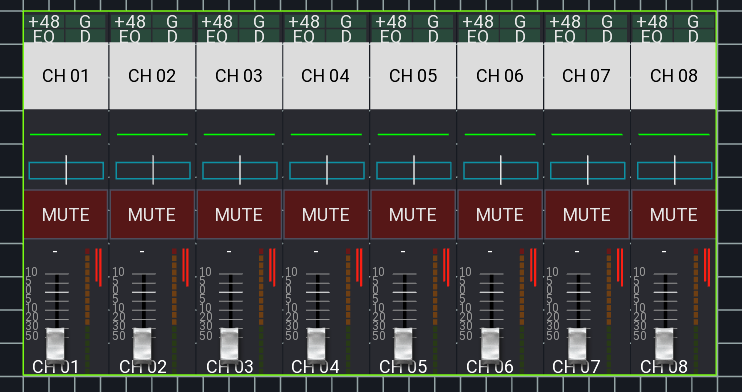
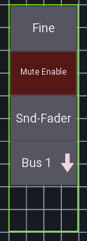
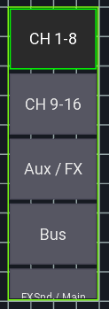
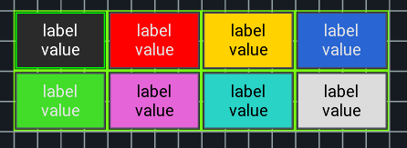
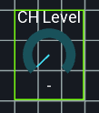
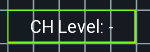

# Custom layout

This feature allows you to fully customize the mixer view to match your workflow
and create new views for different purposes (e.g. fixed installations).

## Structure
You can create an unlimited number of layouts, each of them has a set of UI elements.
**Note:** Landscape and portrait position/sizes are stored independent from each other.
To edit any of the other orientations just rotate your device in the editor.

- Layout Overview
	- Layout
		- UI items
			- One or more [actions](custom-actions.md) per UI item

## Quickstart

1. Open the menu of the main view
2. `Menu -> Setup -> Layouts`
3. Press the `+` menu entry to add a new layout
4. Add and move UI items to your taste

## Layout Settings
While in the layout editor, press the `gear icon` in the top menu to open the layout settings.

From there you can rename your layout or change the mode.

### Layout modes
The layout modes option configures when/how the layout is applied to the app.

| Mode | Description
| --- | --- |
| Default | The layout is only shown if the user manually opens the layout |
| Override mixer layout | The layout replaces the stock mixer layout, |
| Open on startup | Opens the layout on startup. |

The `Open on startup` option is designed for scenarios where you want to limit the parameters accessible (the top menu is empty).
Additionally it's possible to **password protect** going back to the main mixer.

This allowes you to create a dedicated layout (for example for a wall mounted tablet) and completely limit access to anything else in the app.

## UI items
This section describes all available UI items and their configuration parameters

### General
These settings are available for all UI items

#### Settings: Visibility
This settings controls under which conditions the UI will be visible.

| Visibility | Description
| -- | -- |
| Always | Item will always be visible |
| Only SoF | Item will only be visible if SoF is active |
| Not SoF | Item will only be visible if SoF is not active |

### Mixer 
Shows a container which displays all channels of the currently active layer.
This also includes the meterbridge (if enabled in the app settings).

### Channel strip
A single channel strip which can be assigned to a fixed channel,
or a dynamic channel source like the `Bus master`.
Do **NOT** use this if you want "something that follows the layer" - use the `Mixer` instead.

### SoF list
List of buttons for controlling the sends on fader, fine and mute enable status

### Layer list
List of buttons for selecting a layer

### Button
A button can be used to toggle the status of an action

#### Settings: Label
Defines the text that will be shown on the button. It is possible to write multiple lines of text.
See [Label Tags](##Label-tags) for more information.

#### Settings: Touch mode
It is possible to change the touch behavior of the button.
This can be useful when you want to control a mute group, but only when the button was long pressed.

### Knob
A knob can be used to control a numeric value (like a send level or pan).

### Label
A label can be used to show values like the current scene or just for showing text.

#### Settings: Text position
Changes how the text will be aligned on screen.

## Label tags
It is possible to use dynamic text as a label for the UI items.
To do so use one of the following tags:

| Tag | Action | Description |
| -- | -- | -- |
| `[label]` | Any | Shows a short description of the action |
| `[value]` | Any | Shows the current value of the action |
| `[bpm]` | FX | BPM for 1/4 notes |
| `[sofname]` | Sends on fader | Name of the current bus master |
| `[chname]` | Channel actions | Name of the channel of the action |

## Example: Tap delay button
1. Open the mixer layer setup
2. Add a button
3. Add a new action to the button
4. Select the FX action and select the Effect which you want to control
5. Select the time parameter of the FX
6. Go back to the mixer
