# Custom layout

A custom layout is a fullscreen view that can be built to your liking.

This feature allows you to fully customize the mixer view to match your workflow and create new layouts for many
different purposes (e.g. fixed installations).

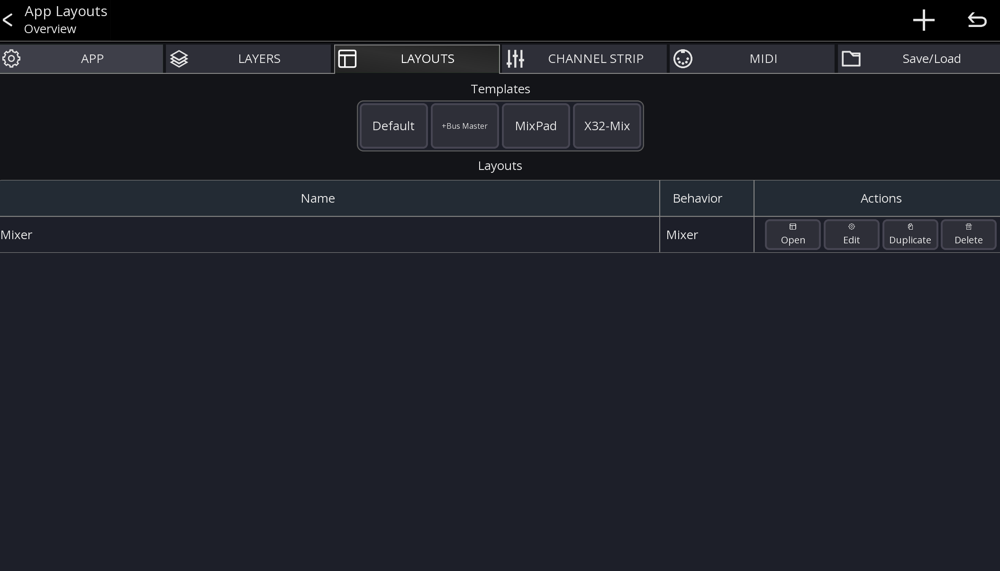

In the layout overview (show above) you can see all layouts currently loaded. From here you can edit and open them.

## Templates

If you don't want to dive into the layout editor just yet, you can choose on of the templates to quickly adjust the apps
mixer to mimic the layout of some other familiar apps.

Pressing a template will create new layout entries automatically.

## Quickstart

1. Open the menu of the main view
2. `Menu -> Setup -> Layouts`
3. Press the `+` menu entry to add a new layout
4. Add and move UI items to your taste

> By default, the first custom layout you create will override the mixer layout.

If you want to go back to the app's default, simply delete your layout.

## Behaviors

A layout can be configured to have different behaviors, which are displayed in the `Behavior` column in the
screenshot above.

- `Mixer`: A layout with this behavior will replace the default mixer layout of the app. This is usually the first view
  that you see after connecting to a mixer.
- `Open on start`: The layout will be opened directly after connecting to your mixer. You'll be able to press the back
  button to return to the mixer view.
- `Default`: The layout must be opened manually using a custom button or via the layout entry shown above.

## Terminology

- UI item: An UI element that can be placed onto a layout (Buttons, Knobs, Channel strips, ...)
- Action: Defines what a UI element should be controlling (for example Mute, Fader level, ect)

The following describes how layouts, UI items and actions correlate to each-other.

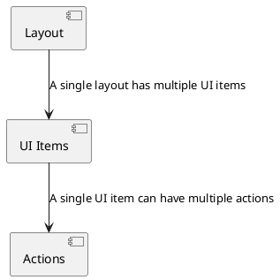
```plantuml
@startuml
 
[Layout] --> [UI Items] : A single layout has multiple UI items
[UI Items] --> [Actions] : A single UI item can have multiple actions

@enduml
```

## Navigating

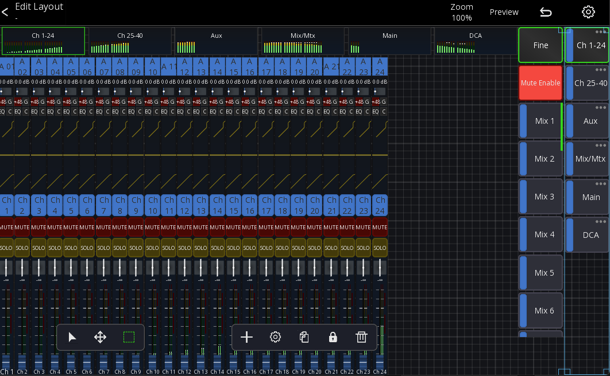

The layout editor has 2 action bars at the bottom of the screen. The left one controls the touch/mouse behavior
and the right one is for the currently selected UI item.

### Move and Resize

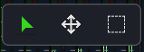

You can simply drag items to move them to another position. To resize an item, simply drag them from one of
their edges, as indicated by the rectangle in each corner of the selected item.

When dragging on an empty spot the view can be panned around.

### Panning and Zooming

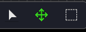

The tool in the middle lets you pan the layout around by dragging anywhere on the screen.

You can also pan and zoom by placing 2 fingers on the screen.
On desktop systems you can press and hold spacebar, or middle mouse button to enable pan mode.

To zoom you can use a 2-pinger pinch gesture or the mouse wheel.

To reset your zoom and pan press the "Zoom" entry in the top menu.

### Selection Mode

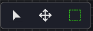

in selection mode you can drag on the screen to select multiple UI items at once.

On desktop systems you can press and hold shift to enter this mode.

## Editing a layout

### Context menu

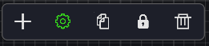

The context menu at the bottom of the screen provides actions for the currently selected UI item.
From left to right:

- Add new UI item
- Open settings menu
- Copy
- Lock/Unlock
- Delete

### Edit a UI item

To edit a UI item select it by pressing on it. Then press the gear icon in the bottom menu.

This will expand the UI item settings menu on the right hand side of the screen:

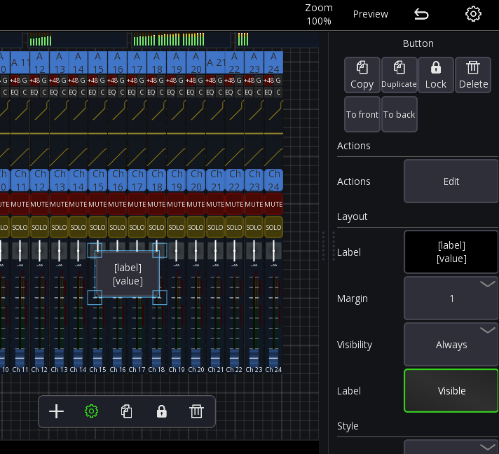

In there you can configure all settings for the currently selected UI element such as text, color and the
assigned [actions](custom-actions.md).

A more detailed explanation is below in the section [UI item settings](#ui-item-settings)

At the top of this menu you also see some additional actions:

- To back/front can be used to move the UI element behind/in front of other UI elements.

The right side menu can be resized by dragging the vertical separator line:

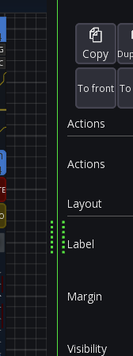

### Layout Settings

While in the layout editor, press the `gear icon` in the top menu to open the layout settings as shown below.

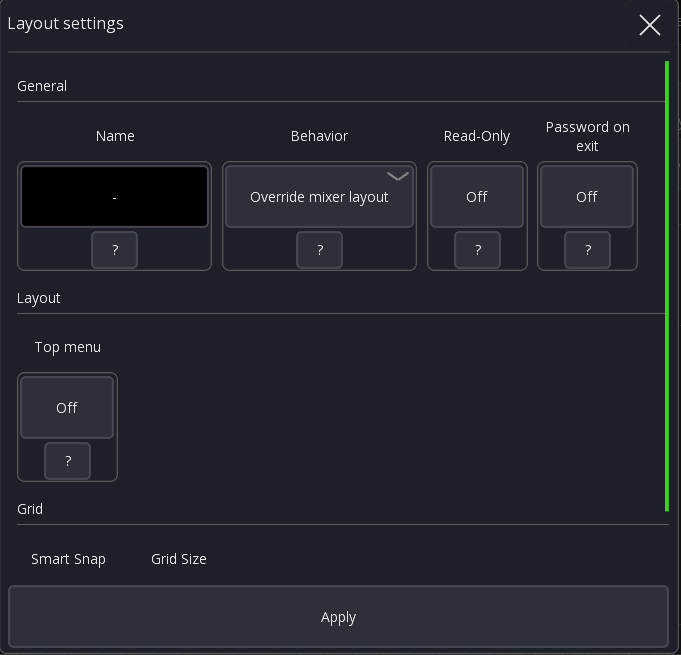

Here you can rename your layout, or change the general behavior.

#### Name

The name that should be used for this layout

#### Behaviour

See section `Behaviors` at the top of this page.

#### Read-only

Makes the entire layout read-only, preventing any user input.

#### Password on exit

Enable to prompt the user for a password before allowing to exit the layout. This can be used for fixed installation
purposes where the regular user should only have access to pre-defined layouts, and only certain people should be
allowed to access the rest of the app.

This is only relevant for layouts not using the `override mixer layout` behavior.

#### Top Menu

Indicates if the top menu should be shown. This is only relevant for layouts which are **not** using the `override mixer layout`
behavior.

## UI Item Settings

This section describes the settings available for the UI items.

Note: Some UI elements may have more or less settings than the ones described here.

### Actions

Shows all actions assigned to the UI item. Click on an entry to open the action, press and hold an entry to
remove it. See [actions page](custom-actions.md#label-tags) for more details.
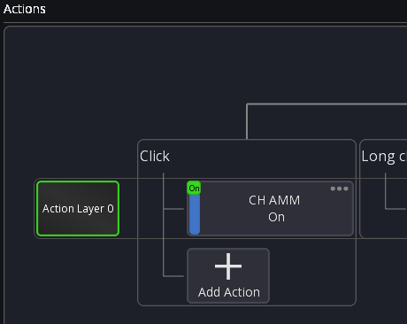

### Label

The label is the text that should be shown on the UI element. You can use action tags to build labels that change based
on the current value, for example:
`[label] [value]`. All available tags can be found on the [actions page](custom-actions.md#label-tags).

### Margin

Defines how big the margin should be of the UI element

### Visibility

This setting controls the conditions under which the UI is visible.

| Visibility | Description                               |
|------------|-------------------------------------------|
| Always     | Item is always visible                    |
| Only SoF   | Item is only visible if SoF is active     |
| Not SoF    | Item is only visible if SoF is not active |

## UI items

An (incomplete) list of the available UI items

--- 

### Mixer

Shows all channels of the currently active layer. This also includes the meterbridge (if enabled in the app settings).

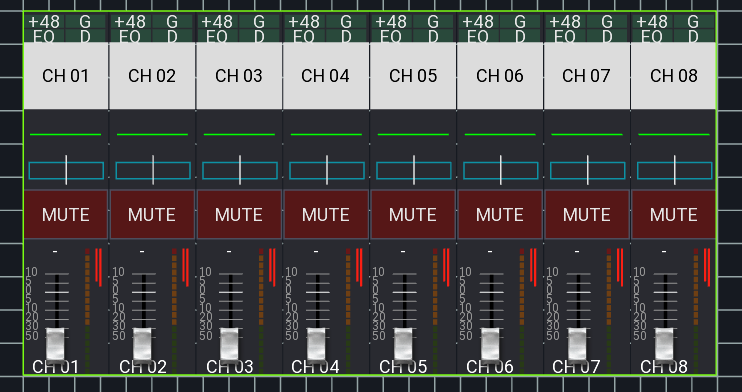
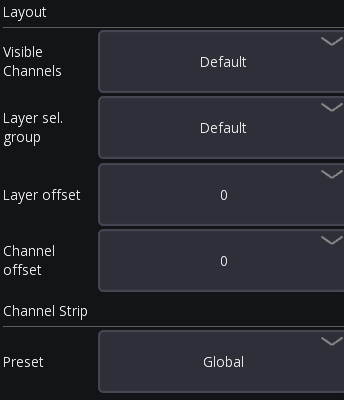

#### Visible Channels

Defines how many channels should be shown, by default it uses the value of your layer settings.

### Layer selection group

Configures which active layer selection should be followed. This allows you to build
mixers which have multiple independent layer selections.

### Layer offset

Changes which layer is currently shown, relative to the currently selected layer. You can use this to build up rows of
mixer elements, each showing a different layer.

### Channel offset

Shifts all channels in the current layer by the selected amount.

### Channel Strip

Defines how the channel strips should look. By default, the [global preset](settings/channel-strip.md) is used.

--- 

### Channel strip

Shows a single channel strip that can be assigned to a fixed, or dynamic channel (for example the current bus master).

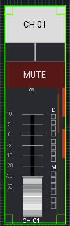

Similar to the mixer element, the look of this item can also be configured to be independent of the global channel strip
settings.

--- 

### Sidebar

List of buttons for controlling the sends on fader, fine and mute enable status.

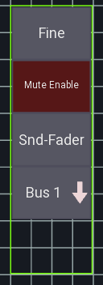

--- 

### Sends on fader buttons

List of buttons for controlling the sends on fader state

--- 

### Layer list

List of buttons for selecting a layer.

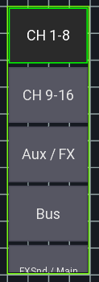

--- 

### Button

A button can be used to toggle the status of an action.

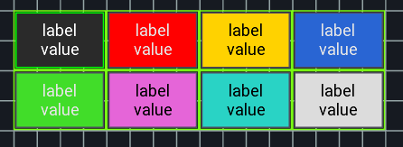

Action slots:

| Slot           | Behavior                                  |
|----------------|-------------------------------------------|
| Click          | Finger needs to touch and lift            |
| Long click     | Finger needs to touch for a longer period |
| Touch          | Finger needs to touch                     |
| Momentary      | Touch triggers "on", lift triggers "off"  |
| Inv. Momentary | Same as `Momentary` but inverted          |

--- 

### Knob

A knob can be used to control a numeric value (like a send level or pan).

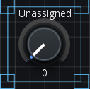

--- 

### Label

A label can be used to show values like the current scene, or just to display text.

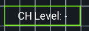

#### Settings: Text position

Changes how the text is aligned on screen.

