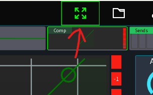

# FAQ

## Does this app work with my mixer?

Probably, take a look at the [versions and features](feature-list.md) page.

## How many app instances can I use?

This depends on your mixer. Some manufacturers / models have a hard limit how many clients
can connect at a time. Best is to consult the manual of your mixer.

## Will this app support mixer XYZ in the future?

Maybe. Adding support for a new mixer is a cost and time-consuming process. Due to lack of documentation for a lot
of devices, a lot of time is required to fully understand the protocol used by certain mixers and implement it
accordingly.

Because of that, either a good emulator or access to the actual hardware is required.

## License activated too many times, what should I do?

Login to your mixing station account and deactivate old, unused devices.
See [manage activations](license/overview.md#manage-activations) for more details.

## I changed devices, how to I restore my license?

The license restore process is described on [the license page](license/overview.md).

Note for Android users: If you migrated your license from the old app the only way to import it again is to import it
using your Mixing Station account. You won't be able to restore it using the `Google Play` option.

## I see no licenses in my account, what can I do?
Licenses are associated based on the email address provided during the purchase.
On Google Play this is by default your gmail address, on purchases made via fastspring 
this is the email you've provided during checkout.

If this email is different from the email used in your Mixing Station account you can request a license move.
To do that, please follow the "[move license](license/overview.md#move-license)" section in the manual.

## Is there a pdf version of this manual?

No, however you can open the [print version](../print_page/) of this page and
save it as pdf in your browser.

## I can't find the GEQ!

If you're using an XAir mixer make sure to change the EQ type to `GEQ`, see screenshot.
In case the left sidebar is missing, press the top `fullscreen` button.

## My faders in the channel view disappeared!

You're very likely in `fullscreen mode` which can be toggled via the top menu:
