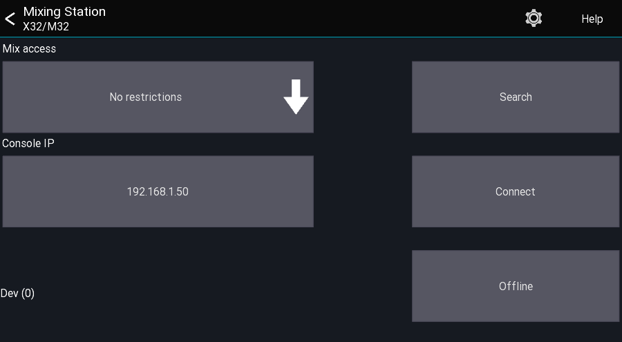

# Getting started

## Compatible mixers
Please make sure your mixer has the latest compatible firmware

| App | Mixers | Required firmware | Notes | 
| -- | -- | -- | |
| XM32 | Any X32/M32 mixer | V1.15 or newer | |
| XAir | Any XAir mixer | V1.12 or newer | |
| Qu | Any Qu mixer | V1.90 or newer | |
| GLD | Any GLD mixer | V1.61 | |
| Si | Any Si Performer/Expression/Impact | V1.8 / V1.8 / V1-2 | See [HiQNet guide](soundcraft/hiqnet.md)

## Offline mode
The offline mode provides access to nearly all app features without
the need of connecting to a mixer.

Some features will not work in this mode:

- Channel link

## Network setup
Please consult the manual of the mixer manufacturer on how to setup your network.
Here is a basic sample configuration:

| Device | IP | Subnet mask | Misc | 
| -- | -- | -- | -- |
| Wifi AP | 192.168.1.1 | 255.255.255.0 | DHCP enabled - Range 192.168.1.20-255 |
| Console | 192.168.1.10 | 255.255.255.0 | - | 
| Android | Assigned by DHCP | - | - |

## First launch

When opening the app you'll see the launcher view.

This view allows you to configure where and how you want to connect to the mixer.

## Mix access
Mix access allows you to restrict access to a certain mix bus. The user will not be able to change any other mix than the one selected.

## Console IP
This field allows entering the console IP address. It's only used the using the `Connect` button.

## App version
In the bottom left of the screen you can see the version of the app

## Menu
The top menu gives you access to the global settings as well as this help page.
