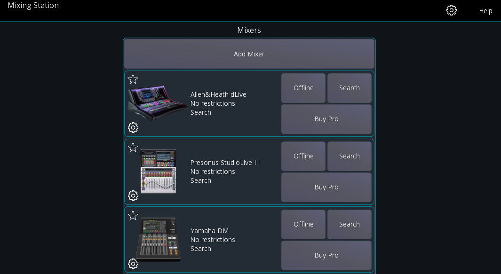
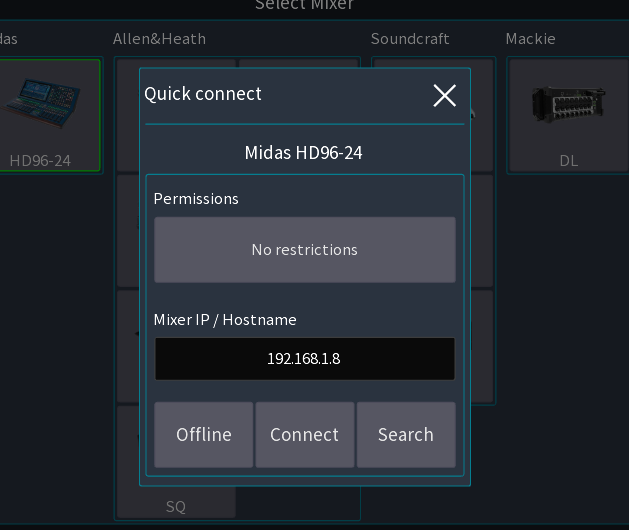
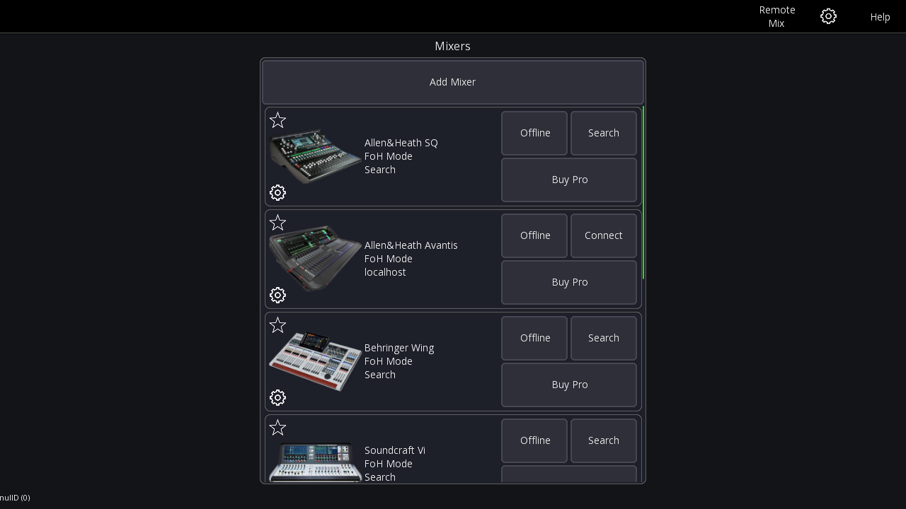
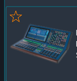
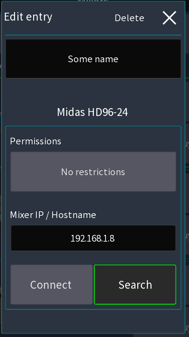

# Getting started

See [features](feature-list.md) for compatible mixers.

## Offline mode

The offline mode provides access to nearly all app features without
needing to connect to a mixer. However, some features that will *not* work in offline mode include the following:

- Channel link
- Mutegroups / DCA hardmute
- Presets (if stored on the mixer)

## Network setup

Please consult the manual of the mixer manufacturer on how to setup your network.
Here is a basic sample configuration:

| Device  | IP               | Subnet mask   | Misc                                  | 
|---------|------------------|---------------|---------------------------------------|
| WiFi AP | 192.168.1.1      | 255.255.255.0 | DHCP enabled - Range 192.168.1.20-255 |
| Console | 192.168.1.10     | 255.255.255.0 | -                                     | 
| Android | Assigned by DHCP | -             | -                                     |

For Soundcraft mixers also take a look at the [HiQNet guide](soundcraft/hiqnet.md)

### iOS privacy settings

Starting with iOS 14 you need to explicitly allow the app to communicate with your local network.
iOS asks for your permission once you try to connect to a mixer for the first time.
You can check the settings in iOS: `Settings > Privacy > Local Network`

## First launch

When opening the app you'll see the launcher view as shown below.

You can select the mixer model you want to use in this view. This will open the Quick-Connect dialog (see below)

### Quick-Connect

Once you've selected the mixer series you want to work with, you'll see the
following view.

This view allows you to configure where and how you want to connect to the mixer.

### Permissions

The `permissions` button allows you to restrict access to certain mix buses.
The user will not be able to change any mix other than the ones selected. This is ideal for personal monitor mixing or
dedicated monitor engineers.
It is also possible to limit the access to multiple mixes.

### Mixer IP / Hostname

This field is used to enter the console IP address or hostname. It's only used in conjunction with `Connect` button.

## Mixer history

If you've already connected to a mixer in the past you'll see the history view instead:

In this view you see up to 10 recently used mixers. Each entry stores the mixer series, connection details such as IP
address
and the permissions.

### Favorites

You can pin connections by pressing the `star` or `mixer icon`:
Pinned entries will always appear at the top of the list
and won't get removed over time.

### Editing entries

You can edit an entry by long-pressing (or `right-clicking`) the entry.
This will open the edit view.
In this view you can:

- Set a name for the entry
- Change the permission settings
- Set the IP/Hostname that should be used for connect
- Configure if you want to connect to a fixed ip address or search for the mixer every time

