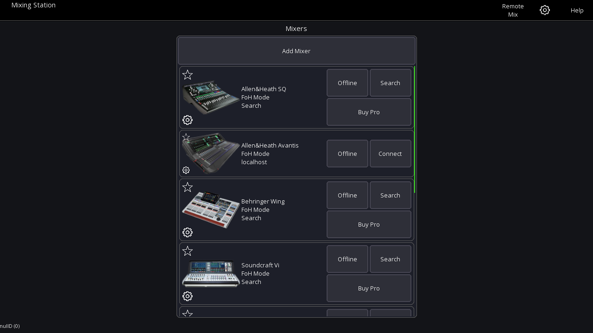

# Getting started

See [features](feature-list.md) for compatible mixers.

## Offline mode
The offline mode provides access to nearly all app features without
needing to connect to a mixer. However, some features that will *not* work in offline mode include the following:

- Channel link
- Mutegroups / DCA hardmute
- Presets (if stored on the mixer)

## Network setup
Please consult the manual of the mixer manufacturer on how to setup your network.
Here is a basic sample configuration:

| Device | IP | Subnet mask | Misc | 
| -- | -- | -- | -- |
| WiFi AP | 192.168.1.1 | 255.255.255.0 | DHCP enabled - Range 192.168.1.20-255 |
| Console | 192.168.1.10 | 255.255.255.0 | - | 
| Android | Assigned by DHCP | - | - |

For Soundcraft mixers also take a look at the [HiQNet guide](soundcraft/hiqnet.md)

### iOS privacy settings
Starting with iOS 14 you need to explicitly allow the app to communicate with your local network.
iOS asks for your permission once you try to connect to a mixer for the first time.
You can check the settings in iOS: `Settings > Privacy > Local Network`

## First launch

When opening the app you'll see the launcher view as shown below.

### Menu
The top menu gives you access to the global settings as well as this help page.

## Mixer series
Once you've selected the mixer series you want to work with, you'll see the
following view.

This view allows you to configure where and how you want to connect to the mixer.

### Permissions
The `permissions` button allows you to restrict access to certain mix buses. 
The user will not be able to change any mix other than the ones selected. This is ideal for personal monitor mixing or dedicated monitor engineers.
It is also possible to limit the access to multiple mixes.

### Mixer IP
This field is used to enter the console IP address or hostname. It's only used in conjunction with `Connect` button.

### App version
The app version is displayed bottom left. 
