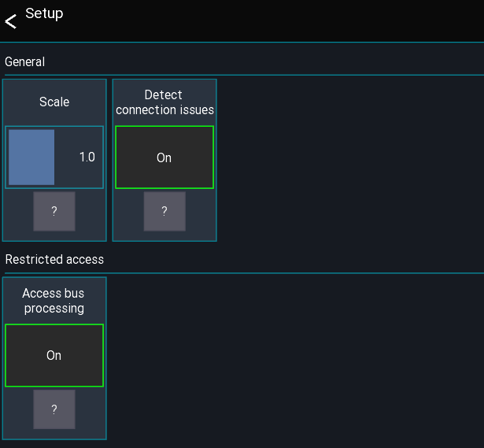

# Global settings
This page gives an overview over the available global settings.
These settings are stored globaly for an app instance.

Note for iOS: Each app variant (e.g. XM32, XAir, ...) stores its own global settings

## Open settings
The app settings can be opened via the menu from the *start view* - directly after opening the app
```
Menu -> Gear icon
```



## Scale
Changes the global UI scale of the app.

## Access bus processing
When enabled a user with restricted access to a single bus is allowed to access the processing of that bus.