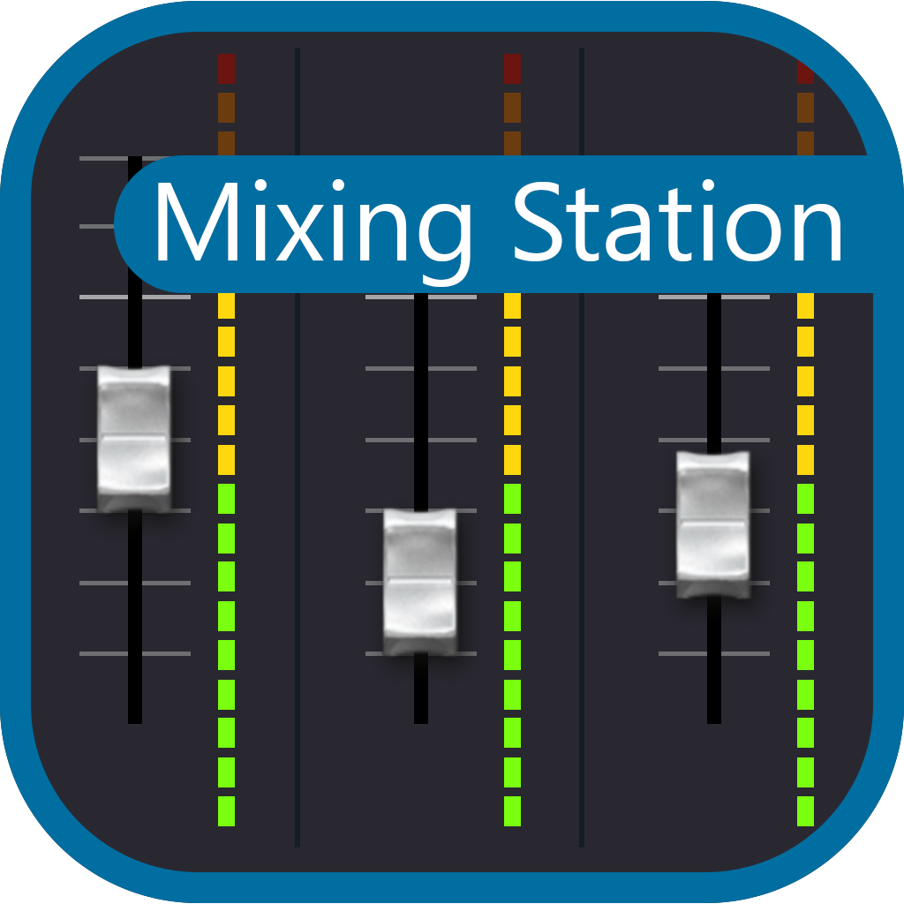

# Mixing Station

Welcome! This page contains all the documentation for Mixing Station.
If you're missing something feel free to [contribute to the documentation](https://github.com/davidgiga1993/mixing-station-docs) or contact me at david [at] dev-core.org 

# Guide
To get a good understanding of the app it's recommended to use the `Next` button at the bottom right to go through the documentation.