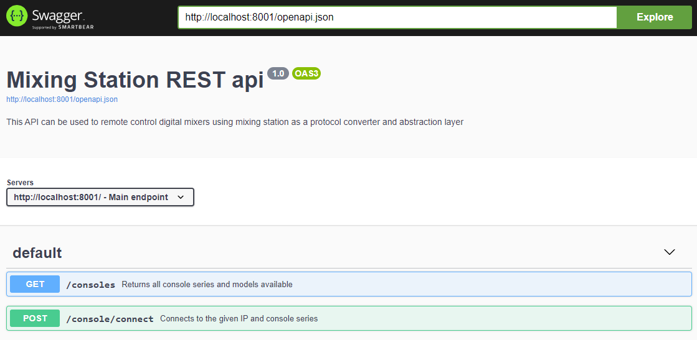

# REST api
Mixing Station PC will soon provide a rest api for 3rd party tool development.

This goal of the API is to cover most of the console parameters using unified endpoints.
Making your app work on every mixer compatible with mixing station.

## OpenAPI
The documentation for the API is generated using OpenAPI.
To view the documentation:

1. Start mixing station with the web server enabled using the program arguments defined [here](../platforms/pc.md).
2. Open the [swagger-ui](https://petstore.swagger.io/){target=_blank}
3. Enter the following url into the top text field `http://localhost:<web port>/openapi.json` and hit `Explore`

The editor should now show the documentation:
