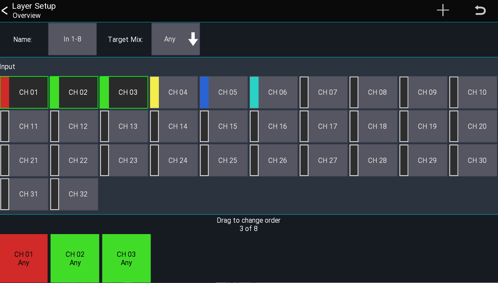

# Unlimited DCAs
Mixing Station can created an unlimited number of DCAs, called "IDCA" channels.

It is also possible to create an IDCA which changes the send level of multiple channels instead of the LR mix.

## New IDCA
To add a new IDCA to a layer, open the `Layer Setup` view.
Press the `+` symbol in the menu and select `IDCA` to open the `IDCA Setup` view as shown below.

## IDCA Setup
This view allows you to assign channels to an IDCA.
Select the mix you want the IDCA to control by pressing the button on the right side of 
the `Target Mix` label. By default `Main LR` is selected.
Now you can select the channels you want the IDCA to control.

## How it works
The IDCA stores the ratios of the levels of the assigned channels.
When a channel level is changed, the ratio is recalculated.
By changing the IDCA fader, all assigned channel levels will be adjusted according to the stored ratios.

The red line behind the fader knob of an IDCA shows the minimum/maximum levels of the assigned channels.