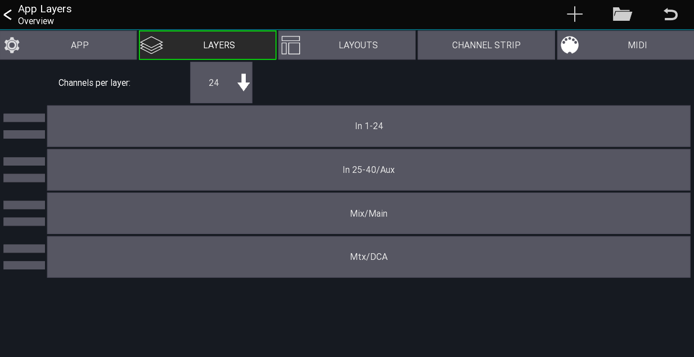
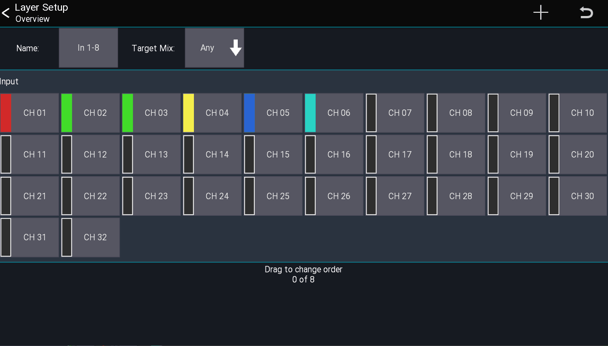

## What is a layer?
A layer defines what channels should be shown in the mixer.
You can creates an unlimited number of layers and 
each layer can contain up to 32 channels in a user definable order.

## Layers overview
This view shows all layers provides layer specific settings

Open from the mixer view:
```
Menu -> Setup -> Layers
```




### Visible channels per layer
There are two modes on how the channels of a layer can be displayed:

#### Auto
This mode will always show all channels assigned to a layer. If required the channel strips will be resized so they fit on the screen

#### Static
The selected number of channels will be shown. If a layer has less channels, placeholders will be shown. If a layer has more channels assigned they will be hidden.

### Layer list
The list in the bottom of the screenshot shows all layers.

- **Drag left bars** Reorder the layer item
- **Press and hold item** Opens a context menu for editing / deleting


## Add new layer
By pressing the `+` menu item you can add a new layer to the list. It will be appended to the bottom.


## Editing a layer
A layer can be edited by selecting `Edit` from the context menu or by **Press and hold** a layer button directly from the mixer view.

Use the `+` button to add more channels / [IDCAs](layer-idcas.md) to the layer.

