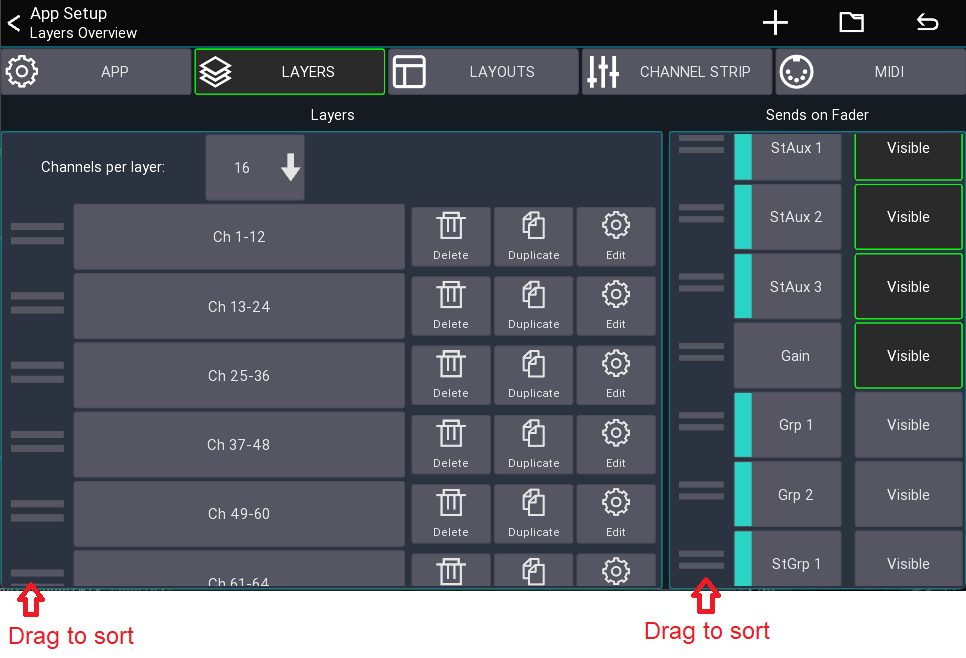

# Layers

This page describes the Layer and Sends on Fader configuration.

## What is a layer?

A layer defines what channels should be shown in the mixer.
You can create an unlimited number of layers and each layer can contain up to 40 channels.

## Layer settings

This view lets you configure all layers as well as change the sends on fader configuration.

Open from the mixer view:

```
Menu -> Setup (gear icon) -> Layers
```



### Channels per layer

Selects the number of channels that should be shown in the mixer.
This also defines the width of the channel strip shown in the mixer. The more channels you show, the smaller each
channel becomes.

When you change this number the app can automatically resize each layer to contain the selected number of channels.
It will automatically take different channel types into account so you always end up with a logical layer setup.

If you select `Fit channels` instead of a number, the app will always show all channels assigned to a layer. If required the
channel strips will be resized so they fit on the screen.

### Layer list

The list on the left side of the screenshot shows all available layers.

You can reorder the layers by dragging on the left bars (see screenshot above).

### Add new layer

Press the plus symbol (`+`) in the top menu to append a new layer to the bottom of the list.

### Reset

Press the reverted arrow in the top right to reset all layers according to the current `Channels per layer` setting.

## Editing a layer

**Press and hold** a layer button from the mixer view or select `Edit` from the context menu to edit a layer.

The `Layer Setup` view displays all assigned channels at the bottom. You can drag them to change the order of the
channels.
Use the menu's `+` button to add [IDCAs](layer-idcas.md) or blank items.


### Target Mix

The `Target Mix` option allows you to select which mix of a channel you want to add to the layer.

This is useful if you want, for example, to be able to change an FX send for your main vocals without using sends on
faders.

By default, the `Any` option is selected. `Any` causes the channel to follow the currently selected sends on fader mix (
default app behaviour). Any other selection causes all channels added in that mode to be fixed to the selected mix.

In the following example I'm adding 3x `Ch 1` but with different target mixes. As you can see in the mixer view, each
fader now controls the send level to the selected mix.


## Sends on Fader

On the right side you can select which mixes should be shown in the sends on fader list of the app.
It is also possible to change the order of the items.

You can reset the configuration to the default using the top menu.


## Layer Selection Group

The layer selection group allows you to select different layers, independent of each other. Think for example of the X32
mixer
where you can select different layers on the left and right fader bank.

This is an advanced feature which is used in combination with the [layout editor](custom-layouts.md) or [midi](midi.md).
You should be familiar with either of those features before continuing.

The selection group can be selected in various places, for example:

- In the layout editor when editing the "Mixer" or "Layer buttons" UI element settings
- When editing a midi device

Here is a simple example how to utilize the selection group:

1. Add a 2nd "Mixer" UI element to your layout
2. Edit the 2nd "Mixer" UI element
3. Change the Layer selection group from `Default` to `A`
4. Now you have 2 mixers, and only one of them follows the default layer selection.
5. To change the active layer of the 2nd mixer: Add a new `Layer Buttons` UI element
6. Edit the `Layer Buttons` and change its selection group to `A`.
7. You now have 2 independent layer selections, each used by a different Mixer in your layout.