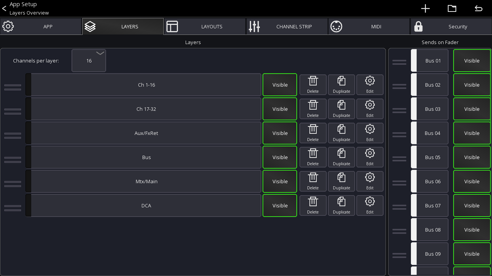

## What is a layer?
A layer defines what channels should be shown in the mixer.
You can create an unlimited number of layers and each layer can contain up to 32 channels.

## Layer settings
This view lets you configure all layers

Open from the mixer view:
```
Menu -> Setup (gear icon) -> Layers
```




### Channels per layer
Selects the number of channels that should be shown in the mixer.
This also defines the width of the channel strip shown in the mixer. The more channels you show, the smaller each channel gets.

When you change this number the app can automatically resize each layer to contain the selected number of channels.
It will automatically take different channel types into account so you will always end up with a logical layer setup.

#### Auto
If you select `Auto` instead of a number the app will always show all channels assigned to a layer. If required the channel strips will be resized so they fit on the screen

### Layer list
The list in the bottom of the screenshot shows all layers.

- **Drag left bars** Reorder the layer item
- **Press and hold item** Opens a context menu for editing / deleting


### Add new layer
By pressing the `+` menu item you can add a new layer to the list. It will be appended to the bottom.

### Reset
Press the back arrow in the top right to reset all layers according to the current `Channels per layer` setting.

## Editing a layer
A layer can be edited by selecting `Edit` from the context menu or by **Press and hold** a layer button directly from the mixer view.


In the `Layer Setup` view you can see all assigned channels at the bottom. You can drag them to change the order of the channels.
Use the `+`  in the menu to add [IDCAs](layer-idcas.md) or blank items.


### Target Mix
The `Target Mix` option allows you to select which mix of a channel you want to add to the layer.

This is useful if you want for example to be able to change an FX send for your main vocals without using sends on faders. 

By default, the `Any` option is selected. `Any` will cause the channel to follow the currently selected sends on fader mix (default app behavior). Any other selection will cause all channels added in that mode to be fixed to the selected mix.


In the following example I'm adding 3x `Ch 1` but with different target mixes. As you can see in the mixer view, each fader now controls the send level to the selected mix.

