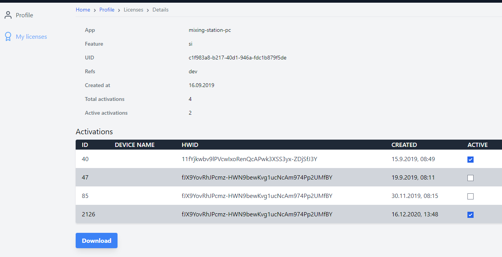

Due to the different app store policies each platform (iOS, Desktop, Android) has it's own licensing system.
Therefore, you **can't** use one license on another platform (e.g. an iOS license on Android).

It is possible to use one license on multiple devices of the same platform (e.g. multiple Android tablets).

## Mixing Station account (Desktop, Android)
All licenses can be managed using your [Mixing Station account](https://mixingstation.app/profile/licenses). If you don't have an account yet, you can [register here](https://mixingstation.app/profile/create).

Make sure to use the same email address as used for purchasing otherwise we can't link the license to your account!

### Manage activations
Once you've selected a license in your mixing station account, you'll be able to see all 
activations for this license.

If you switched devices, or re-installed the app multiple times you may need to disable old activations,
in order to activate the app again on your new  device.
This can be done by unchecking the checkboxes in the `Active` column:

## Activation
Each license can be activated on 4 different devices at the same time. 
Once the limit has been reached you can either deactivate devices you don't use anymore (see [manage activations](#manage-activations)) or 
purchase another license.

## Restore licenses
The following describes how to restore / import the license on another device.

### iOS
Make sure you're logged in with the same Apple id.

### Desktop
You can always access your licenses using your Mixing Station account.

### Android
You can always access your licenses using your Mixing Station account.

As an alternative you can select `restore purchases` in the license page inside the app to restore any previous in-app purchases made with your Google account (this won't work if you migrated your license from the old app).