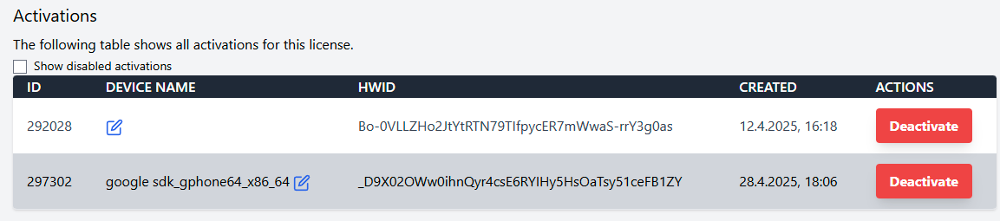
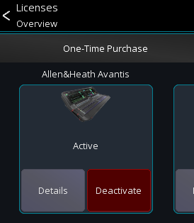
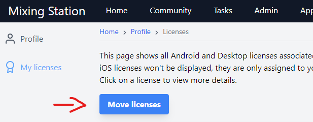
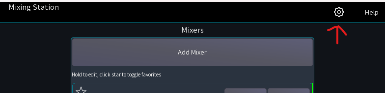
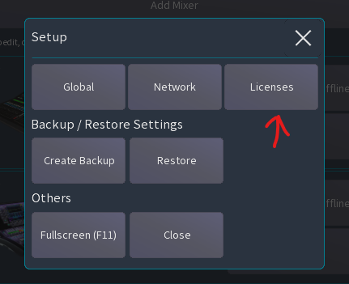
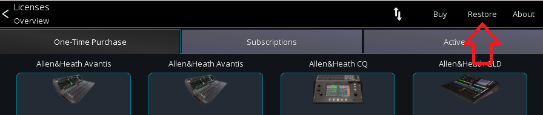

# Licenses

## Licensing models

Mixing Station has two licensing models:

| Type              | Single mixer | All mixers | Any platform | Can expire | 
|-------------------|--------------|------------|--------------|------------|
| One-Time Purchase | ✅            | ❌          | ❌            | No         |          
| Subscription      | ❌            | ✅          | ✅            | Yes        | 

They are explained below in more detail.

### One-Time Purchase

A single license unlocks a single mixer series on a single platform (iOS, Android, Desktop).

Therefore, you **can't** use one-time Purchase licenses on another platform (e.g. an iOS license on Android).

One license can be activated on up to 4 devices of the same platform (e.g. multiple Android tablets).
If you need more active devices you can purchase additional licenses
from [the  mixing station website](https://mixingstation.app).

#### iOS

iOS one-time purchases are special as the licenses are **not** bound to any Mixing Station account, just to your Apple
ID.
Thus, they can be used on any number of iOS device as long as it's using the same Apple ID. Because of that moving iOS
licenses is not possible.

No limitations apply to subscriptions.

### Subscription

A subscription will unlock all supported mixers in the app.
The subscription can be imported on up to 4 devices (of any platform).

Details can be found on the dedicated [Subscription](subscription.md) page.

## Mixing Station account

Licenses can be managed[^1] using your [Mixing Station account](https://mixingstation.app/profile/licenses).
If you don't have an account yet, you can [register here](https://mixingstation.app/profile/create).

> Make sure to use the same email address as used for purchasing otherwise we can't link the license to your account!

[^1]: One-Time Purchase licenses on iOS are only bound to your Apple ID and won't appear in your account.

### Manage activations

Once you've selected a license in your mixing station account, you'll be able to see all
activations for this license.

If you switched devices, or re-installed the app multiple times you may need to disable old activations.
You can do this by either:

a) Pressing the "Deactivate" button in your mixing station account:

b) Pressing the "Deactivate" button on the device you want to deactivate:

## Move license

You can move licenses from one email to another using the `Move license` button.

Enter the source email, from which you want to move the licenses and confirm.
An email will be sent to the source email which you'll need to confirm.

Afterward, all licenses previously associated with the entered source email will be moved
to your account.

## Restore licenses

The following describes how to restore / import the license on another device:

Note that this only works before you connect to the mixer. If you are already
connected, the menus are not accessible.

### iOS

Make sure you're logged in with the same Apple ID as used for the initial purchase.

In case nothing happens when using the `Restore purchases` button, and you are 100% sure you're using the correct Apple
ID,
you can try pressing the `Buy` button again as it's not possible to purchase the same feature multiple times.
This might be required when switching to a new iOS device since Apple doesn't load all in app payments correctly all the
time.

### Android

You can restore your licenses from your Mixing Station account or the app store used for the
purchase (`Google Play`, `Amazon`, ect)

> Important: When you previously migrated your license it can only be
> restored using your Mixing Station account!

### Desktop

You can restore access your licenses using your Mixing Station account or the `.lic` file.

