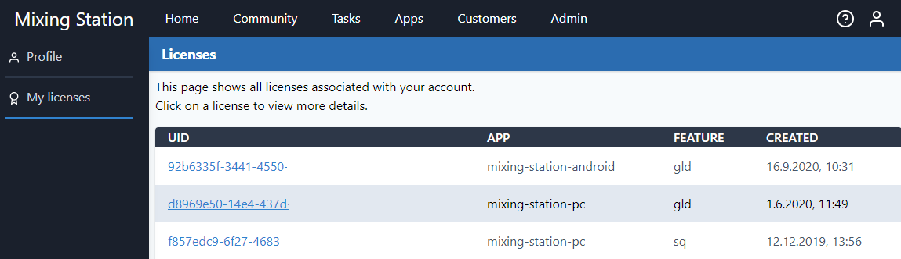
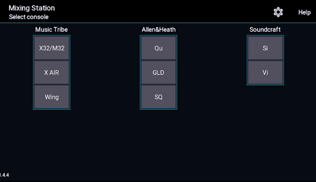
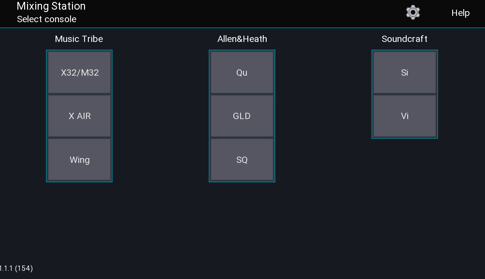
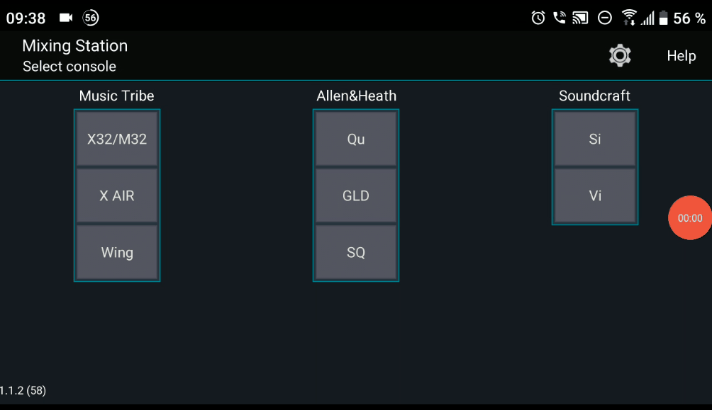

This page does **not** apply to iOS.

## Mixing Station account
All licenses can be managed using your [Mixing Station account](https://dev-core.org/mixing-station/profile/licenses). If you don't have an account yet, you can [register here](https://dev-core.org/mixing-station/profile/create).

Make sure to use the same email address as used for purchasing! Otherwise we can't link the license to your account.

## Activation
Each license can be activated on a limited number of devices. Once the limit has been reached you can either deactivate devices you don't use anymore or purchase another license. This can be done on your Mixing Station account page.

## Restore licenses
The following shows you how to restore / import the license on another device.

### iOS
Make sure you're logged in with the same apple id.

### PC
You can always access your licenses using your Mixing Station account.

### Android
You can always access your licenses using your Mixing Station account.
