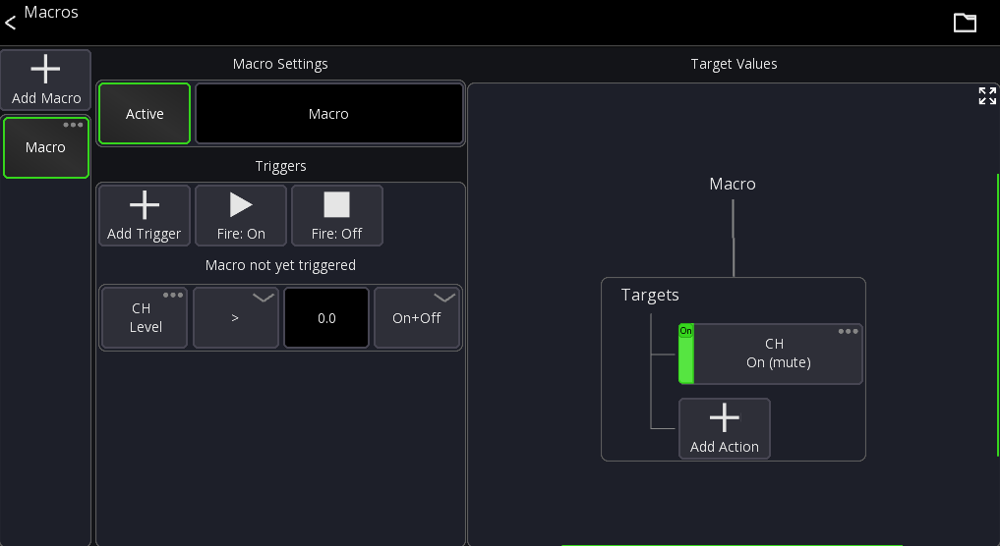

# Macros

Macros allow you to change values in the app based on certain conditions.

## Theory of operation

A Macro has `Triggers` and `Target Values`. The Triggers define when the Macro
should be executed. You can also trigger them manually.
Every trigger can fire either an `On` or `Off` value. This gets passed to the Actions.

The `Target Values` define what parameter(s) should be changed.

Every trigger only executes once per state change. For example:

If the trigger is defined to fire if a fader value is > 0dB it will only fire `On` 
once the value is > 0dB and not for any additional value changes above 0dB.
Once the value is lower than 0dB it will fire `Off`.

Macros are stored together with the other [User Settings](settings/user.md).

## Usage

1. Press the `...` menu button in the mixer view
2. Select `Macros`

The list on the very left contains all your macros. The screen on the right shows the
settings of the currently selected macro.

To delete a macro press and hold the macro button.

### Macro Settings

Each macro has a name and an active state (disabled macros do nothing).

### Triggers

Automatic Triggers can be added by pressing the `Add Trigger` button.

To fire a macro manually use the `Fire: On` and `Fire: Off` buttons. Alternatively you can also
assign the `Macro` action to a custom layout or midi device to trigger a macro.

This will add a new trigger to the list. Every trigger has:

- Source value
- Comparator (greater than, less than)
- Threshold value
- Mode

If the source value changes it will be compared using the comparator against the threshold.
For example `is source value greater than 0?`. The mode defines what should happen
if the condition is met. It can either fire `On` and `Off` depending on whether the condition
is met or not. Or it can always fire `On` if the condition is met, or always `Off` if the condition is met.

Using multiple triggers the different modes allows you to build more complex behaviors, for example:

- Fire `On` if level > 0
- Fire `Off` if level < -20

### Target Values

On the right side of the screen you see all target values assigned to the macro.

A target value must be an on/off value, so either simple values like "On/Off" or if you want to
change other parameters use the [Set Value](custom-actions.md#set-value) action.