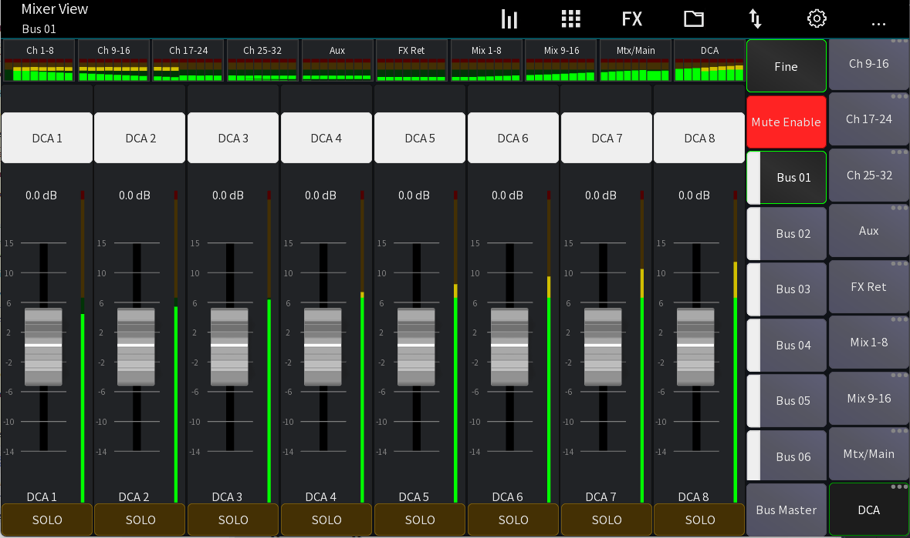

# MCAs

Mixing Station by default allows you to use your DCAs while
in sends on fader mode. This allows you to quickly change
the contribution of other mixes.

## What is an MCA?

An MCA is the same as a DCA but rather than controlling
the signal contribution to the main mix, it changes the
contribution to a bus (monitor mix).

## How to use?

Enable sends on fader mode and go to your DCAs.

As you can see the fader scale changes to `-15dB - +15dB` and you
can change the level of all assigned channels relatively.

Every time you enter this mode, the fader will be reset to the
center, so you have the entire range to motion.

Note: MCAs only work in in unrestricted mode. Please use [IDCAs](layer-idcas.md) if you want to give your performers the ability to control volume groups for their mix on stage.
