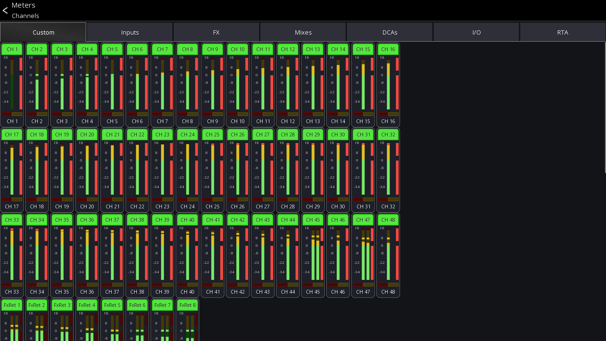

# Metering

The metering colors in Mixing Station are mixer independent. It always uses +4dbU as reference point at the
green-yellow transition, and red for clipping.

The metering scale follow the mixer-specific units. So if a mixer uses dBFS, the labels will be dbFS.
If a mixer uses "dB" (A&H for example) the scale text will be in dB.

You can find a detailed metering scale when opening the "Metering" view (top menu) or by opening a channel (see below).

In the mixer view, there is no metering scale available.

## Meter Views

Mixing Station provides various meter views which can be accessed via the top menu in the mixer view.

The top tab-bar can be used to choose what meters you want to see. The `Custom` section
displays the metering of the current layer configuration.