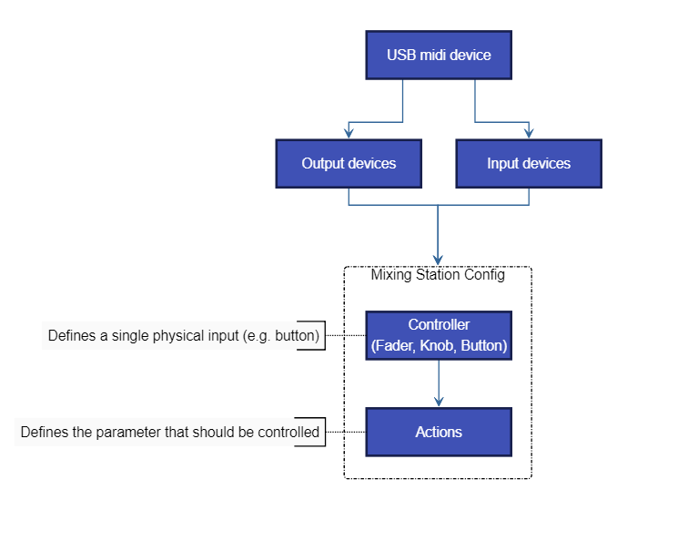

# Midi

You can use any generic midi device to remote control the mixer via Mixing Station.

## Supported protocols
- General Midi
- Mackie Control (MCU - recommended)
- X-Touch (in MCU mode, with metering and LCD support)
- X-Touch Expander (in MCU mode, with metering and LCD support)
- Waves FIT (in LV-1 Mode, with LCDs and colors)
- Baby HUI (deprecated)

## Known issues
### Android
In Android 5.0 (Lollipop) only the last plugged USB device is working correctly. This is a [known bug](https://code.google.com/p/android/issues/detail?id=159897) in Android and cannot be fixed.

### iOS / MacOS
iOS 15/16 and MacOS 13 have a bug in midi stack of the operating system causing them to not support fast sysex messages. This causes MCU mode not to work correctly (faders moving to random locations).
Make sure to update to iOS 17/MacOS 14.

## Default mappings
The MCU and HUI protocols have a default mapping in Mixing Station, making it very easy to get started.
The default mapping is shown at the bottom of this page.

### MCU
By default, the channels are mapped to the currently active layer in Mixing Station.

#### Channel strips
| Control | Action | Description |
| --- | --- | --- |
| SELECT | Select in Mixing Station | - |
| MUTE | Mute | - |
| SOLO | Solo/PAFL | - |
| REC | Not assigned | - |
| VPOD | Multiple | The knob can control multiple parameters depending on the selected assignment |

#### Buttons
| Control | Action | Description |
| --- | --- | --- |
| TRACK (Assign-1) | Gain on knobs | - |
| SEND | Sends 1-8 on knobs | of the selected channel |
| PAN/SURROUND | Pan on knobs | - |
| PLUG-IN | Gate on knobs | of the selected channel |
| EQ | Not yet implemented | - |
| INSTRUMENT | Dynamics on knobs | of the selected channel |
| - | - | - |
| < BANK > | Prev / next layer | - |
| < CHANNEL > | Scroll current layer | Scrolls 4 channels in the current layer (if more than 8 channels) |
| F1-F8 | Sends on fader | Bus 1-8 |


## Overview
A midi device will be represented in the app as one or more input / output devices.
In the app you define `faders`, `buttons` and `knobs` (called controller) which then use one of those input/output devices.



- Midi controller (fader, button, ..)
	- Uses one midi input and output device
	- Has one or more actions assigned defining the parameter that should be controlled

### Controller types
There are three controller types available:

- Button: Midi device sends a value when pressed and/or released
- Fader: Midi device sends an absolute value when fader/knob is moved (e.g. `0-127`)
- Knob: Midi device sends a fixed value for each increment / decrement (e.g. `24` and `27`)


## Midi Setup
The midi overview can be opened from the mixer via the menu:
```
Menu -> Setup -> Midi
```
You can add / edit the midi devices form here.

### Add a new device
1. Press the `+` item in the menu to add a new device.
2. Give the device a name, select the appropriate protocol and input / output ports you want to use.
3. Press `Apply`.


### Add a new controller
1. Select the midi device you want to add a controller to.
2. Press the `+` item in the menu to add a new controller.
3. Select the controller.

### Configure a controller
The edit controller view allows you to change the properties of the controller:

- Unique name: Name that will be shown in the controller overview
- Input/Output: Selects which USB device should be used for Midi communication

#### Output Modes
The output mode configures when the value should be sent back to the midi device.

| Mode | Description |
| -- | -- |
| On value change | Sends midi value when the action value has been changed without a midi input |
| On midi event+change | Sends a midi event when a midi event was received or the action value has been changed |
| On note up+change | Sends a midi event when a "note up" command was received or the action value has been changed |

#### Mapping a midi parameter
In general you can just press the `Learn` button and move/press the fader/button you want to assign.
The app will automatically detect the midi channel and parameter type.

You can also configure the parameters yourself:

- Event type: The event type defines what midi command the controller should react to.

	| Event type | Description |
	| -- | -- | 
	| Note On/Off | Triggers the action on "Note On" and "Note Off" events |
	| Note On Triggers the actions on "Note On" events |
	| Note Off | Triggers the actions on "Note Off" events |
	| CC | Triggers the actions on "Control Change" events |
	| Pitch | Triggers the actions on "Pitch" events |

- Channel: The midi channel that should be used
- Param A/B: These two selections are for filtering the midi parameter.
Depending on the currently selected event type the names of the parameters will change.
A value of `-1` means that the value will be ignored.
- Value source: Selects which midi parameter should be used as a value source.
Example: A fader sends midi CC events. The position of the fader will be sent as `Value` of the CC command so this parameter should be used. Select `Param B` to choose the second parameter which in this case is 
the `Value` parameter.

	Note: Buttons do not require a value source because the action will be triggered as soon as a matching midi command is received.

#### Additional button settings
- Output "on" value: Sets the value that should be sent when the button is currently `on`. Some midi devices can show different colors depending on the midi value so this parameter can be used to change the color.
- Mode: How the button should react to midi commands

	| Mode | Description |
	| -- | -- |
	| Toggle | One button press toggles the value |
	| Momentary | Press and hold for an `on` command. Release for an `off` command |
	| Momentary inv. | Same as `Momentary` but inverted |

#### Additional rotary settings
- Multiplier: Sets the sensitivity of one increment/decrement step
- Inc value: Midi value for a single increment
- Dec value:  Midi value for a single decrement
