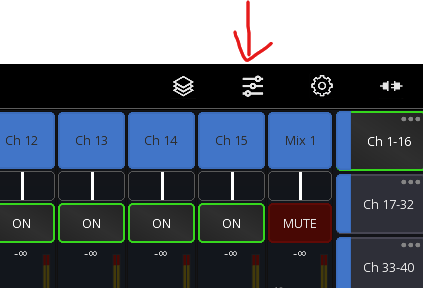
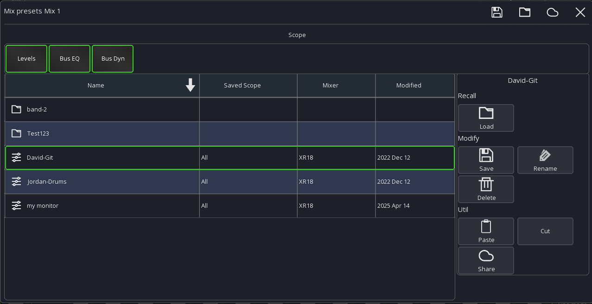

# Mix Presets

Mix presets allow you to store a (monitor) mix on your device and recall it later.

A common use case for this would be a band with changing members. Each member can recall their personal monitor mix
without having to deal with mixer scenes, cues or other stuff.

The presets are mixer independent, allowing you to recall your mix even in other locations.

## Usage

Mix presets can be accessed via the top menu. If you're in personal monitoring mode
the top menu will already show the "Mix Preset" icon.
In regular access mode the button is in the `...` sub-menu.

## Scope

The scope selects which additional settings you want to load.
If you have access to your bus channel you can also load the global EQ and dynamic settings.

## Community

You can upload your presets to your ms-account and load them from any other device.