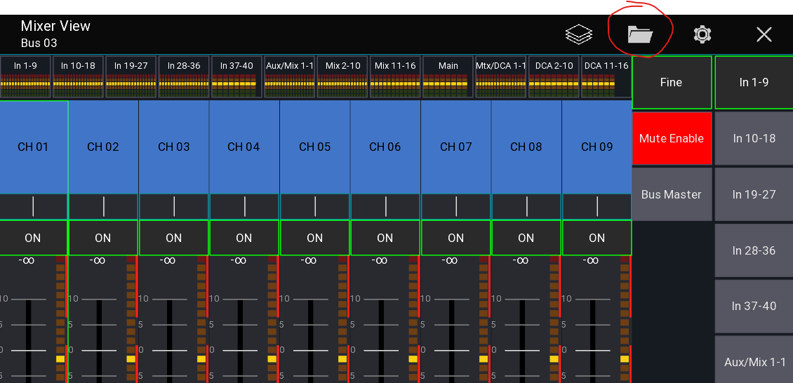
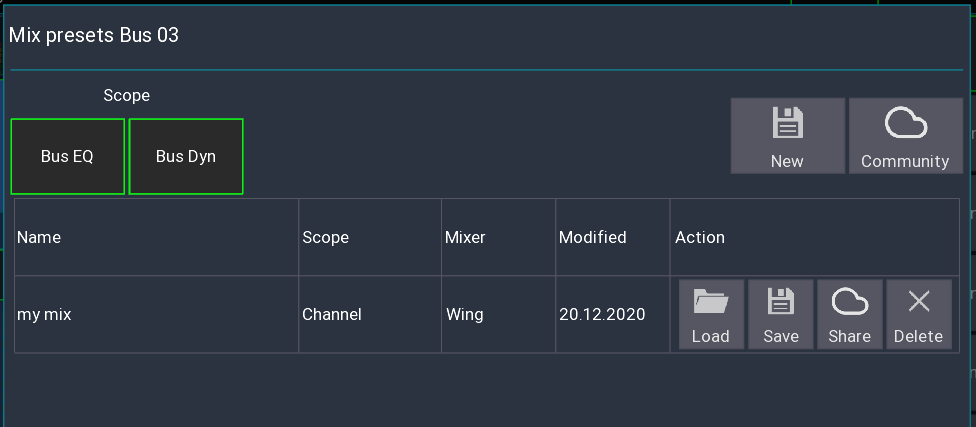

Mix presets allow you to store your monitor mix on your device and recall it later.

A common use case for this would be a band with changing members. Each member can recall their personal monitor mix without having to deal with mixer scenes, cues or other stuff.

The presets are mixer independent, allowing you to recall your mix even on other locations.

## Usage
1. Start app in restricted access mode
2. Menu -> Folder icon

## Scope
The scope selects which additional settings you want to load.
If you have access to your bus channel you can also load the global EQ and dynamic settings.

## Community
You can upload your presets to your ms-account and load them from any other device.