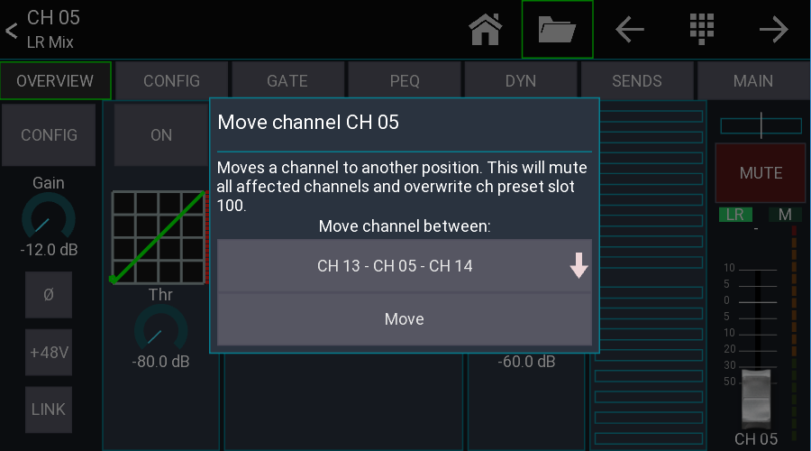

# General

## Mixer specific settings

The X32 series has some mixer specific settings in Mixing Station. Those can be found
in the [app setup -> mixer](../../settings/app.md) view.

### Follow X

There are various settings to follow the current selected channel or view.

When enabling the `Follow ch select` option, the app will follow the currently selected channel on the mixer.
This means if you're selecting a different channel in the app, it might revert back to the channel selected on the mixer-side.

This means you'll need either to disable the follow option when using mixing station standalone, or also enable `Mixer follow Ch select`
which will update the channel selection on the mixer side when you change it in Mixing Station.

## Bus password protection

It is possible to lock certain buses with a password (Mixing Station only).

### Usage

1. Open the "Security view": `Menu -> Setup -> Security`
2. Enter a password. The password is stored on the X32 and is **NOT** encrypted
3. Select the buses you want to protect. `Main LR` will lock the `No restrictions` mode.
4. Press back to close the view and store the settings on the X32.

When you connect to the X32 and the data sync is completed, a password prompt will be shown if the bus you want to
access is protected.

### Supported devices

All devices using Mixing Station. Any other app including the X32-Mix will simply ignore this setting as it is a custom
solution.

### Where is the password stored?

The security settings are stored in the `Name` field of the 100th routing preset on the X32. The routing preset itself
will not be touched.

### How to reset the password?

Save and then delete the 100th routing preset using any official X32-Edit app.

## Channel move

The channel move feature allows you to move a channel to another position.
Since this process requires a channel preset it's only available when connected to the mixer.

### How to use

1. Select the channel you want to move by pressing its channel button.
2. Press the folder icon in the top menu bar -> Select `Move`
3. Select the position where you want the channel to be moved to. The `[INS]` label represents the position where the
   channel will be after moving it.
4. Press `Move`

**Important notice:**
All channels between start and destination position will be muted to avoid possible feedback while the channels are
moved.
The source channel will be stored in channel preset slot 100.
Make sure you've got a good network connection!

### Signal source

The signal source of a channel is fixed to its position. Due to the nature of how the move process works the routing
will stay fixed to the physical channel.

Before moving

| Channel | Source |
|---------|--------|
| Ch 01   | 01     |
| Ch 02   | 02     |
| Ch 03   | 03     |
| Ch 04   | 04     |
| Ch 05   | 05     |

After moving `Ch 05` to `Ch 01`

| Channel | Source |
|---------|--------|
| Ch 05   | 01     |
| Ch 01   | 02     |
| Ch 02   | 03     |
| Ch 03   | 04     |
| Ch 04   | 05     |

### How it works internally

1. Mute all affected channels
2. Save source channel as channel preset 100
3. Copy all channels in between one space to the left/right
4. Load saved preset at destination position

## Network traffic: X32-Mix vs Mixing Station

Some users reported a delay and lag with the X32-Mix iPad app, so I wanted to investigate the differences in network
communication between the two apps.
In the following discussion, the X32-Mix iPad app is simply referred to as "X32-Mix".

Here are some quick facts about the network protocol used by the X32 (this will be the same for both apps):

- OSC (Open Sound Control) send via UDP
- UDP is not connection based, nor does it guarantee that all packets are delivered.
- OSC data structure:
    - Path string: This indicates what content is in the package. Example: /ch/01/mix/level
    - Value string: Information about the type and order of the values in the OSC message
    - Value(s): Values attached to the OSC message. (Numbers, Text, etc.)

### Keeping data in sync

One key function of a remote app is to show the current values of the console. To achieve this, the data in the app and
the data in the console need to stay in sync.
There are two different methods to get data from the X32:

- Polling (X32-Mix): The app sends a `/subscribe` command to the X32. The X32 then sends the requested value every 50 ms
  for the next 10 seconds. The 10-second timeout can be halted by sending the same command again.
- Events (Mixing Station): The app sends a `/xremote` command to the X32. The X32 responds with all value changes that
  occur in the next 10 seconds.

As you may have noticed the "event" mechanism only sends data when a value changes. This saves a lot of data! This is
also the reason why Mixing Station requires a sync when connecting and X32-Mix doesn't because every 50 ms it retrieves
all values that are currently visible.

### Measurements

| View            | X32-Mix iPad receive | X32-Mix iPad send | Mixing Station receive | Mixing Station send |
|-----------------|----------------------|-------------------|------------------------|---------------------|
| Sync            | N/A                  | N/A               | ~65                    | ~50                 |
| Mixer Ch 1-8    | < 1                  | ~44               | < 1                    | ~21                 |
| Change to Ch9-8 | ~20                  | ~44               | ~5                     | ~34                 |
| LR PEQ          | < 1                  | ~28               | < 1                    | ~7                  |

All values in kByte/s

For better comparison here are some differences regarding the data requested by the apps:

| Feature                 | X32-Mix iPad | Mixing Station |
|-------------------------|--------------|----------------|
| RTA data                | No           | Yes            |
| GR meters in mixer view | No           | Yes            |

### Why the lag?

You still may wonder "why does the iPad app lag sometimes?"
The data that is displayed on screen is not cached inside the app, it's the last data that was received from the X32 via
the network.
This means, when you drag the fader on the screen with your finger, the fader shown on the screen only moves when the
value that is sent back from the X32 to X32-Mix is updated.
On a regular network this isn't a issue, but we're talking about a WiFi network that has to transfer a lot of small
packets in both directions. Depending on the WiFi-Router,
some packets will get lost and the average latency will increase. Also when you change the view in X32-Mix it has to
wait until all required values arrive before it can show
any content as the app has no local cache to store old values.

### How does Mixing Station stay in sync?

As you may have noticed, UDP may drop some packages. If a value has been changed (like a mute button) and the packet
gets lost, the app will not be notified about the change.
To overcome this issue, Mixing Station periodically syncs all required values in the background.
This also means that if a package gets lost, the app might be out of sync for up to 1 minute.