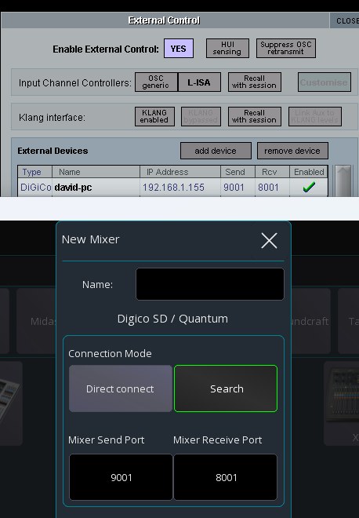

# DiGiCo

Support for DiGiCo mixers is currently private as it has some serious limitations
due to the incomplete OSC API of the mixer.

If you want to have more features / use Mixing Station properly, please let DiGiCo know about it!

## Access

1. Enter [secret mode](../../beta.md#secret-mode-pre-release)
2. Enter `sd` and confirm 

## Configuration
 
1. On the mixer go to `Setup -> External Control`
2. Enable `External Control: Yes`
3. Press `add device` -> `DiGiCo Pad`
4. Enter the IP address of the device running Mixing Station. You can leave the ports default
5. Make sure the entry is marked as `Enabled`
6. In Mixing Station enter the same ports as shown on the mixer, see screenshot below as an example

## Limitations
- Only 1 client per mixer
- No metering
- No routing
- No headamp control depending on the input
- Not all channel parameters accessible