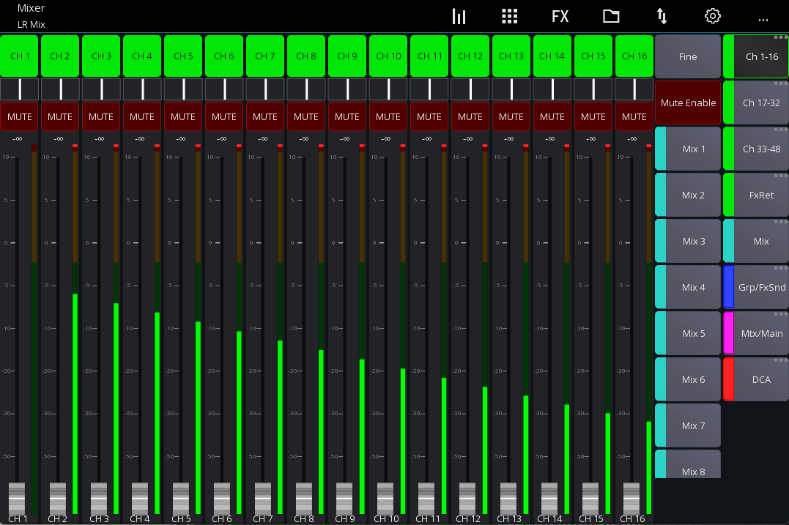
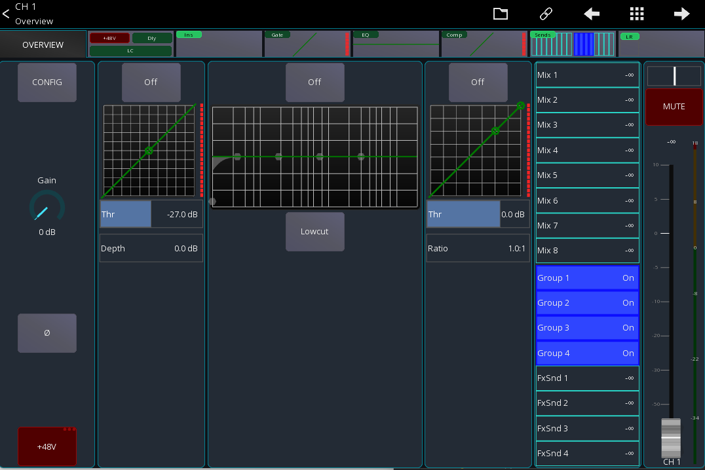
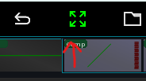
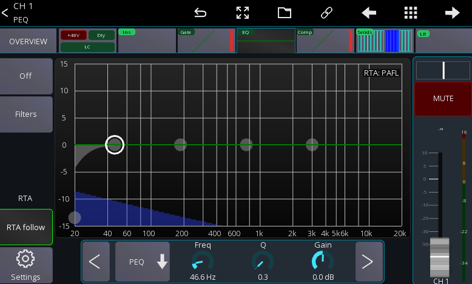
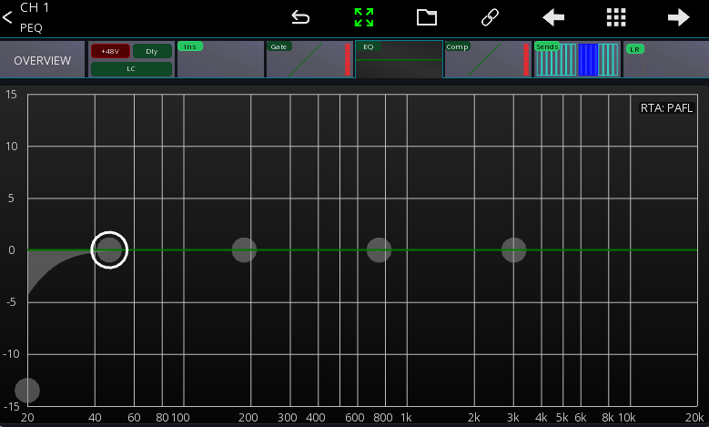
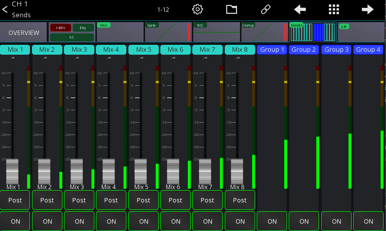

# Mixing

This section describes the basic steps for Mixing with Mixing Station

## Mixer

After connecting to your mixer (or starting offline mode) you'll see the "Mixer" view:

In this view you'll see the channels according to the currently selected [layer](layers.md)
as well as the previous mentioned "Mixer sidebar".

To change the number of visible channels, checkout the [layers](layers.md) documentation.

## Channel View

When pressing a channel it will by default open the channel view:

In this view you can control all parameters of a single channel. The tabs at the top represent
the different processing blocks of a channel (for example gate, eq, compressor).

The top menu provides various utility functions such as:

- Copy/Paste
- Presets
- [Quick gang](channel-links.md#quick-gang)
- Mutegroups

The sliders on the right are providing a quick overview over all sends this channel has.
You can press a slider to open the sends view directly see the pressed send.

### Fullscreen mode

In the channel view some views have a so called `fullscreen mode` indicated by the arrow icon in the top menu:

Pressing this button will hide certain UI elements to increase the size of the center view:

| Disabled                                 | Enabled                                |
|------------------------------------------|----------------------------------------|
|  |  |

### Sends view

The sends view shows all sends of a single channel:

Depending on the mixer not all sends will fit on a single page. In the top menu will be a toggle button
(in this case labeled `1-12`) to go through all the different pages.