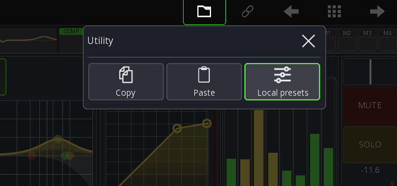
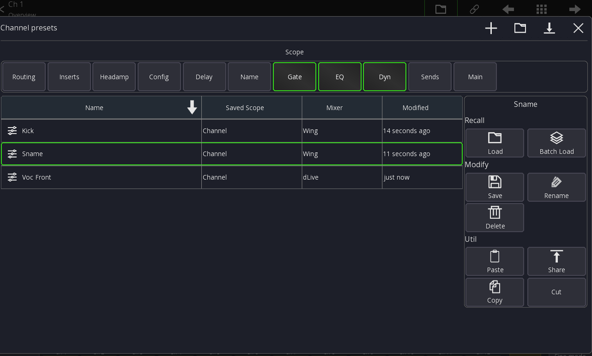

# MS Channel Presets

MS Channel Presets store all parameters of a single channel on your device.

You can recall a MS Channel Presets on **any** mixer that is supported by Mixing Station.

This allows you to very quickly get your mix ready on another desk, even from another manufacturer!

## Usage

In the channel view select the `Folder` menu item:

This view will show all presets that match the currently selected scope.
Any preset that does not match the scope will not be shown.

### Saving

To save a new preset press the `+` button in the top menu.

A MS Channel Preset will only store the data selected as Scope

### Loading

Select the preset you want to load and press the `Load` button.

### Scopes

The scope defines what data should be recalled/stored.

The selected scope will be adjusted based on the view that is currently open.
So for example when opening the channel presets from the Gate view, it will only have `Gate` selected as scope.

Here is a table of what each scope contains

| Scope   | Description                                    |
|---------|------------------------------------------------|
| Routing | Channel input routing                          |
| Inserts | Insert routing                                 |
| Headamp | Gain/Phantom/Pad                               |
| Config  | Trim, DCA/Mute assign, Link, A&H: Preamp model |
| Delay   | Channel delay                                  |
| Name    | Name, Color, Icon                              |
| Gate    | All Dyn1/Gate parameters                       |
| EQ      | All EQ parameters (PEQ+GEQ)                    |
| Dyn     | All Dyn2/Compressor parameters                 |
| Sends   | Send Level/On/Tap                              |
| Main    | Fader, Mute, Pan                               |

## File handling

See [MS Scenes file handling](ms-scenes.md#file-handling)