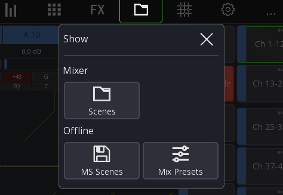
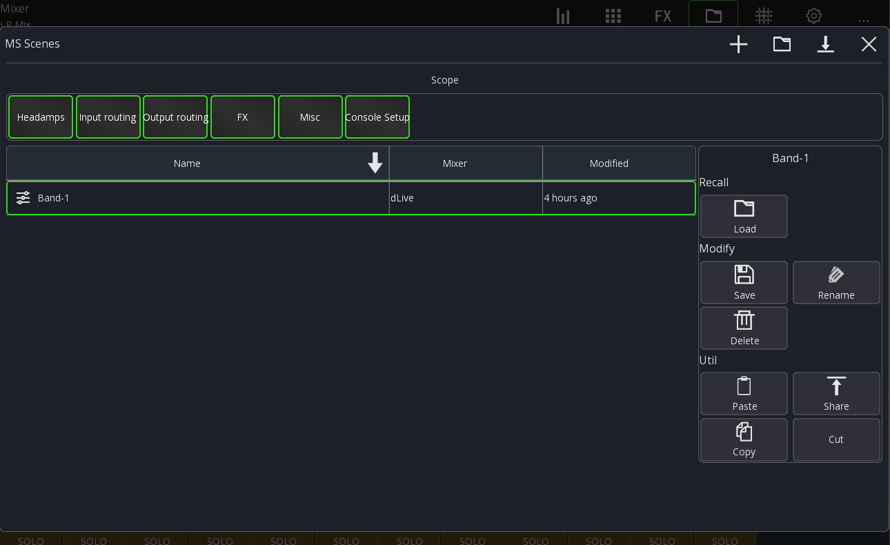
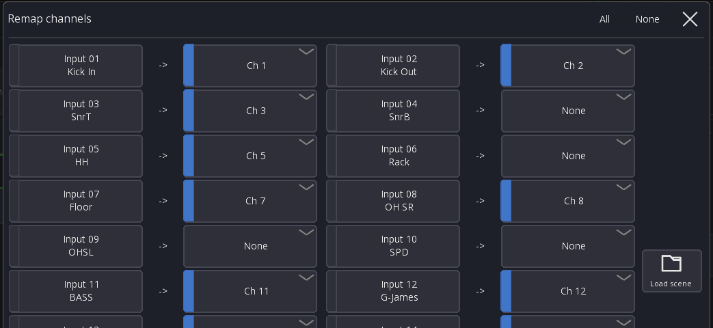
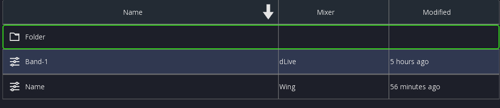
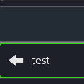

# MS Scenes

MS Scenes store all mixer parameters of the current session on your device.

You can recall MS Scenes on **any** mixer that is supported by Mixing Station.

This allows you to very quickly get your mix ready on another desk, even from another manufacturer!

## Usage

MS Scenes can be accessed via the main menu `Show` button:

### Saving

To save a new scene press the `+` button in the top menu.

A MS Scene will always store all the data, regardless of the selected scope.

### Loading

Select the scene you want to load and press the `Load` button.

Only the parameters selected in the "Scope" section will be recalled.

After pressing `Load` you'll see all channels in the scene with a preview
where each channel will be recalled to:

You can also change the target channels, allowing you to re-map the channels.
This is useful if you for example load the scene on a different mixer and need
to adjust to a different channel count.

Or if you have less inputs than usually and don't want to recall all channels.

After recalling a scene you may get a list of errors encountered during recall.
This is expected when recalling on a different mixer model where certain functionality is missing.

### Scopes

Here is a table of what each scope contains

| Scope          | Description                               |
|----------------|-------------------------------------------|
| Headamps       | Gain, Phantom, Pad for ALL headamps       |
| Input routing  | Wing: Source configs, X32: Input blocks   |
| Output routing | Output sockets, Direct outs               |
| FX             | All FX racks                              |
| Misc           | Mutegroups, AMM (Automix)                 |
| Console Setup  | PAFL Settings, global console preferences |

## File handling

Press the `Folder` menu item to create a new folder:

To leave the folder double tap on it again:

### Moving scenes

1. Select the scene you want to move
2. Select `Cut`
3. Open the folder you want to move the scene to
4. Select `Paste`