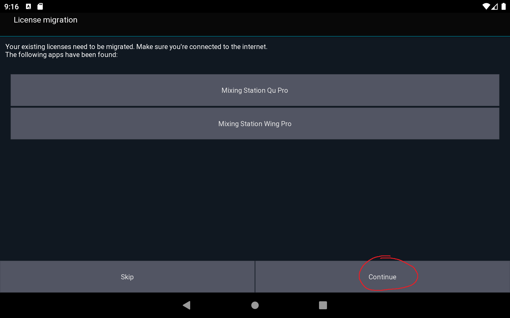
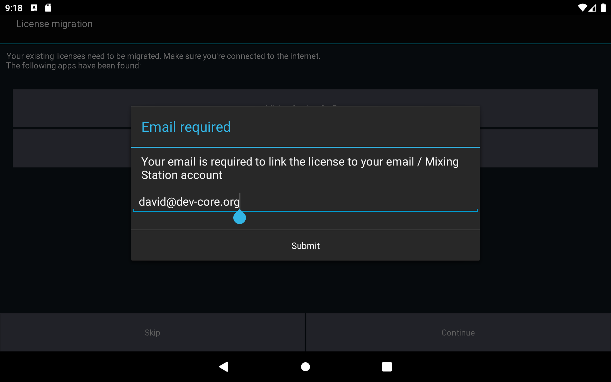
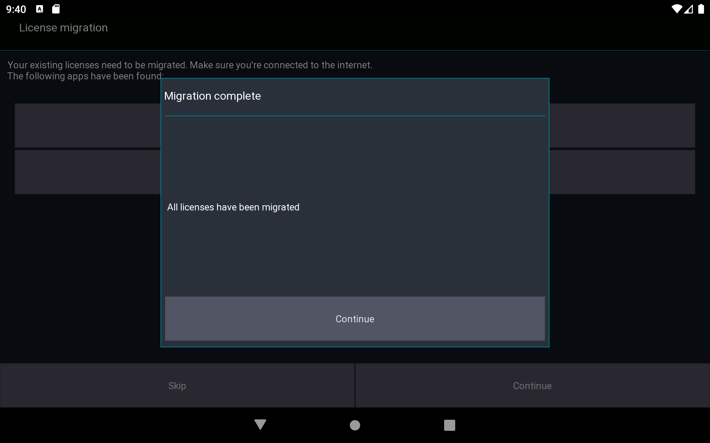
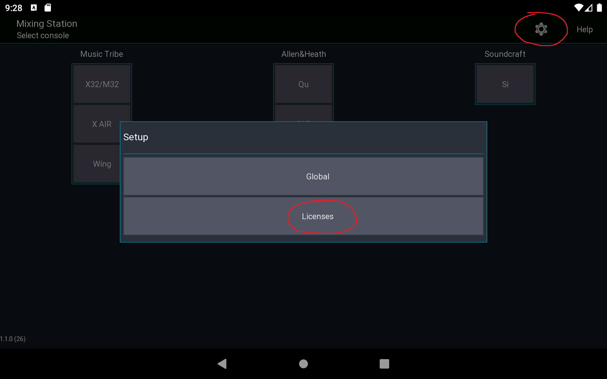
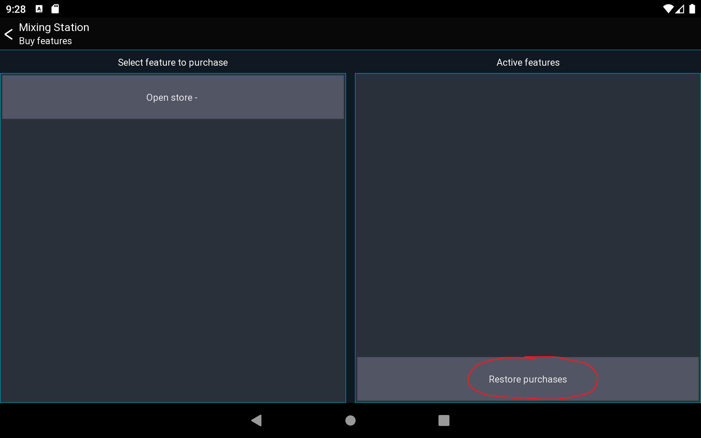

# Android

## Requirements

- Android >= 5.0
- Chromebooks are not supported (but still might work)
- Some android emulators might work

## Settings location

The app stores all settings in the internal storage of the device.

You can access all setting files at `Internal/Android/data/org.devcore.mixingstation/files/MixingStation`

## Migration

In the past, Mixing Station was available in multiple versions, one for each supported mixer model.
All of these apps have been merged into one. The old apps won't receive any updates in the future.

Your existing pro versions will be converted into licenses for the new app.
Here is a step by step guide:

1. [Download the new app](https://play.google.com/store/apps/details?id=org.devcore.mixingstation)
2. Make sure you have installed all the Mixing Station Pro versions that should be migrated
3. Start the new app
4. A list of all your existing pro licenses is displayed.
   
5. All licenses will be associated with an email address.
   Select your Google account or enter your email address.
   
   
6. Done! You can now uninstall all other Mixing Station apps from your device

### Multiple devices

If you have multiple devices, follow the guide above for the first device, then continue here for the other devices:

1. Create a [Mixing Station account](https://mixingstation.app/profile/create) with the same email address as above
2. Select `Skip`
   
3. Open the license page
   
4. Select `Restore purchases`
   

### Settings

Due to more restrictive Google Play policies, the app settings can't be migrated automatically.
To overcome this issue either export/import your settings using the [community feature](../settings/overview) or
copy the files manually to the new location as shown below:

From `internal storage/MixingStation` to `Internal/Android/data/org.devcore.mixingstation/files/MixingStation`
