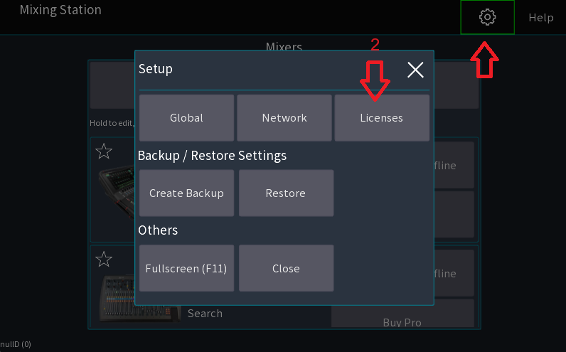
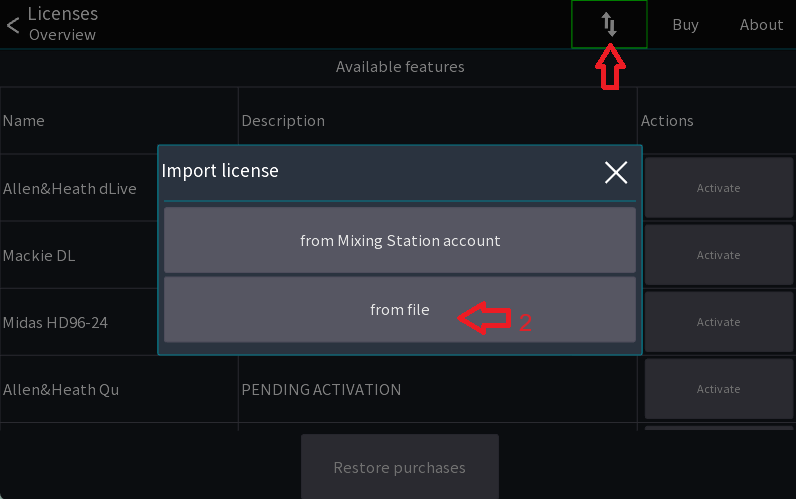
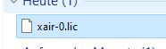

# Desktop

## Requirements

- Operating system:
    - Windows 11 (x64) (Windows 10 x64 will still work but not recommended)
    - macOS 10.15 or later
    - Linux (arm64, x64) support for GL ES3.0 (openGL)
- Screen: Any screen works

## Touchscreen

Multitouch is supported on Windows 10/11 as well as macOS.
For macOS, you need the TouchBase driver `7.1.108` or newer.

Please make sure the app is working in offline mode before purchasing any licenses!

## Settings locations

All settings and license files are stored in one folder

| OS      | Location                                                                                                                | 
|---------|-------------------------------------------------------------------------------------------------------------------------|
| Windows | `%USERPROFILE%/MixingStation`                                                                                           |
| macOS   | `%HOME%/MixingStation`                                                                                                  |
| Linux   | `$XDG_CONFIG_HOME/MixingStation`<br/>`$HOME/.config/MixingStation`<br/>`$HOME/.MixingStation`<br/>`$HOME/MixingStation` |

## Licensing

After purchasing a license you will receive a download link to a license file. Make sure to keep a backup of your
license files in case of data loss!

You can import the license into the app via the license page:

Either select `Mixing Station account` or `from file`

Then select your license file



## Scaling

Mixing Station tries to honor the scaling option of the OS.
If for whatever reason the UI is too large to too small you can manually adjust the scaling in the global app settings.
See [settings](../settings/global.md) for more details

## Keyboard shortcuts

This section is work in progress.

| Key   | Function         | View         |
|-------|------------------|--------------|
| Left  | Previous channel | Channel view |
| Right | Next channel     | Channel view |
| Up    | Previous layer   | Mixer        |
| Down  | Next layer       | Mixer        |

## Program arguments

You can provide the following additional command-line arguments to Mixing Station.

| Parameter    | Description                                                              | Purpose                        |
|--------------|--------------------------------------------------------------------------|--------------------------------|
| `-appSeries` | Which mixer series to use. Same value as the button text in the app      | Auto connect                   |
| `-ip`        | IP address of the mixer. Remove if you want to start the search instead. | Auto connect                   |
| `-mixTarget` | Target mix for the access restrictions. See table below                  | Auto connect                   |
| `-web`       | Port of the webserver (disabled by default)                              | [API](../integrations/apis.md) |
| `-osc`       | Port of the OSC server (disabled by default)                             | [API](../integrations/apis.md) |

Example

```
mixing-station.exe "-appSeries=X AIR" -ip=192.168.1.1 -mixTarget=-1
```

#### Mix Targets

| Value | Target          |
|-------|-----------------|
| `-1`  | No restrictions |
| `0`   | Bus 1 / Mix 1   |
| `1`   | Bus 2 / Mix 2   |
| ...   | ...             |

### Auto connect

Since V0.0.8 you can configure Mixing Station to automatically connect to a mixer on startup. See the example above.

## Known issues

- Intel HD Graphics 620, Driver 26.20.100.6859 - please downgrade to 22.20.16.4836