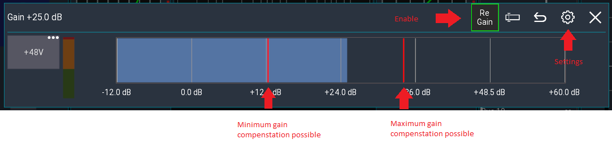

# Re-Gain
This feature allows you to change the gain/trim of a channel without affecting the monitor sends / gate / dynamics.

A typical use case would be if an input is louder than during soundcheck and you need to adjust the gain but keep the monitor sound stable.

## Usage
1. Open the config page of the relevant channel
2. Press and hold the gain knob (or right-click)
3. Enable "Re Gain" from the top menu
4. Adjust the gain

## Adjustment
Gate and dynamics thresholds will be increased / decreased with the gain value.
Sends / Faders will be adjusted in the inverted direction.

### Example

| Value | Before | After |
| --- | --- | --- |
| Gain | 0dB | 5 dB |
| Gate thr | -20dB | -15dB |
| Fader | -15dB | -20dB |

