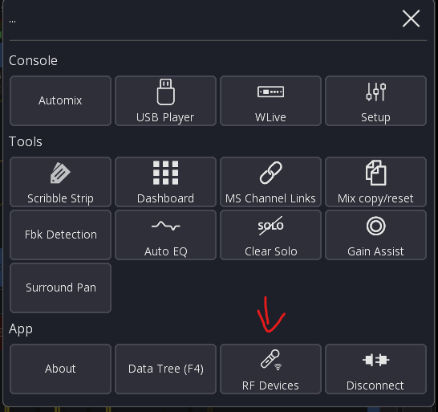
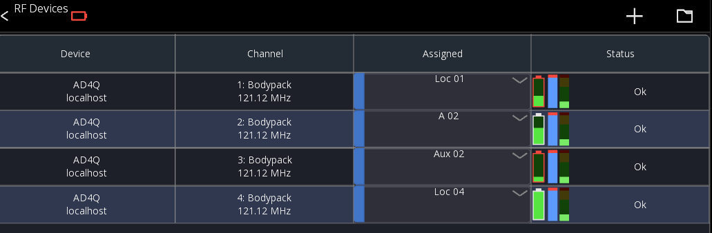
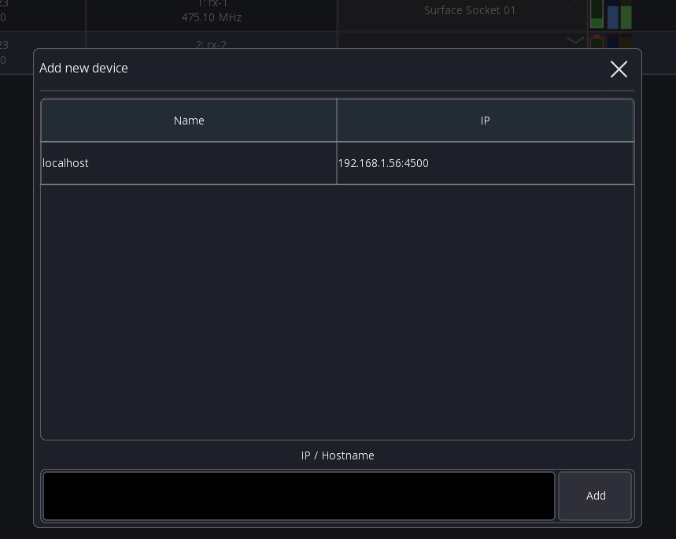
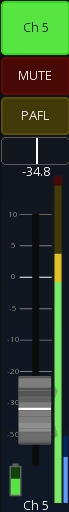

# Wireless Device Integration

> Currently in beta test (V2.5.0)

Mixing Station allows you to connect to your wireless audio receives for battery and signal level
information.

The feature requires an active subscription (or the `RF Integration` license), but can be tested for 10min per session without a license.

## Compatible Devices

| Brand      | Series        | Remarks  |
|------------|---------------|----------|
| Shure      | Axient        | Untested |
| Shure      | ULX-D         | Tested   |
| Shure      | QLX-D         | Tested   |
| Shure      | SLX-D         | Untested |
| Shure      | UHF-R         | Untested |
| Sennheiser | EM6000        | Untested |
| Sennheiser | ew 300-500 G4 | Tested   |
| Sennheiser | EW-DX         | Tested   |

Note that due to lack of hardware access most of the integrations are yet untested.
This table will be updated once I receive more feedback.

## Usage

In the Mixer view open the main menu and select `RF Devices`:

In the `RF Devices` view you can add new RF receivers using the top menu buttons:

The table shows you all configured devices and RF channels.
In the `Assigned` column you can configure where the RF receives is connected to your mixer.

This allows mixing station to know which audio channel corresponds to which RF channel.

In the `Status` column you can see the battery level, RF level and audio level.

If a wireless device is running low on battery, a global warning will be displayed (see top left in the screenshot).

### Adding new devices

Press the `+` icon in the top menu to add new devices. Depending on the device model, an automatic search is available:

Otherwise, you'll have to manually enter the IP address of the device.

When you add a device using the search results Mixing Station will automatically search for the device
again when opening the app, allowing you to have the receivers on dynamic IP addresses (DHCP).

When manually entering the IP address Mixing Station will only try to connect to that specific IP.

### Battery indicator

The battery indicator will display additional information based on the
state of the wireless device.

- Red border: Device is muted
- Cross: Wireless device is disconnected
- Battery level

## Channel Strip integration

By default, the channel strip will show the battery and RF level.

You can also add them manually in the channel strip editor in case you're not using the fader UI element.