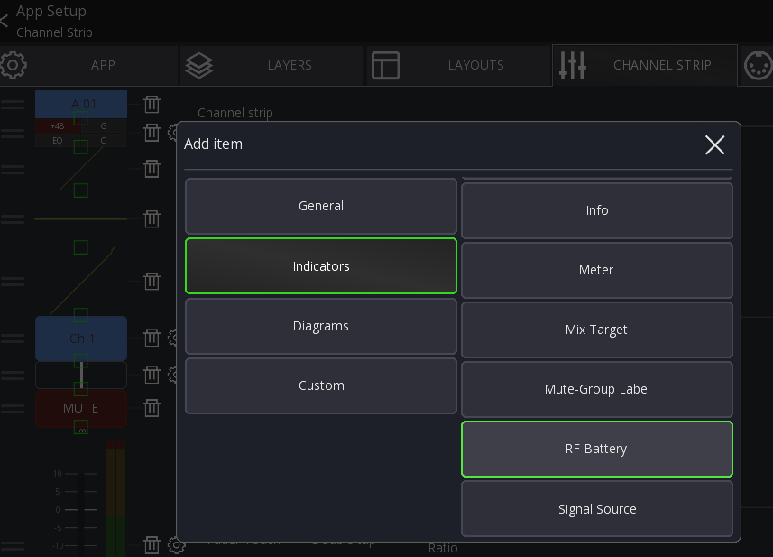
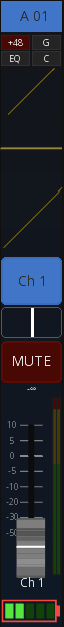

# Wireless Device Integration

> Currently in beta test (V2.5.0)

Mixing Station allows you to connect to your wireless audio receives for battery and signal level
information.

## Compatible Devices

| Brand      | Series        | Remarks  |
|------------|---------------|----------|
| Shure      | Axient        | Untested |
| Shure      | ULX-D         | Untested |
| Shure      | QLX-D         | Untested |
| Shure      | SLX-D         | Untested |
| Shure      | UHF-R         | Untested |
| Sennheiser | EM6000        | Untested |
| Sennheiser | ew 300-500 G4 | Untested |
| Sennheiser | EW-DX         | Untested |

Note that due to lack of hardware access most of the integrations are yet untested.
This table will be updated once I receive more feedback.

## Usage

In the Mixer view open the main menu and select `RF Devices`:

In the `RF Devices` view you can add new RF receivers using the top menu buttons:

The table shows you all configured devices and RF channels.
In the `Assigned` column you can configure where the RF receives is connected to your mixer.

This allows mixing station to know which audio channel corresponds to which RF channel.

In the `Status` column you can see the battery level, RF level and audio level.

If a wireless device is running low on battery, a global warning will be displayed (see top left in the screenshot).

### Battery indicator

The battery indicator will display additional information based on the
state of the wireless device.

- Red border: Device is muted
- Cross: Wireless device is disconnected
- Battery level

## Channel Strip integration

You can configure the channel strip to show the battery of the connected RF device.
For this open your channel strip configuration and add a new item:

All RF related items start with the `RF` prefix. More will be added in the future.

Once that is done, you can place and resize the item in your channel strip:

