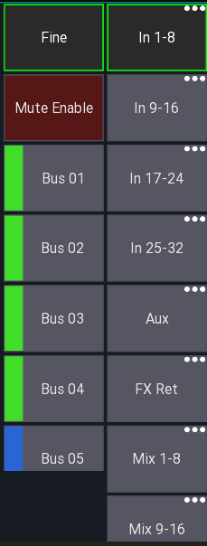

# Sends on faders
Sends on faders allows you to quickly access all sends to a certain mix.
When enabled all faders will show the level send to the selected bus instead of the LR mix.

There are two possible UI modes available:

| SoF list enabled (default) | SoF list disabled |
| --- | --- |
|  |  |

## Bus master
The *bus master* is the master channel of the currently selected mix.
If sends on fader is disabled this will correspond to the LR mix. Otherwise to the selected target mix.

### SoF list
This is the default UI mode. Here each mix is represented by a button.
Pressing that button will enable sends on fader mode.

### SoF list disabled
In this UI mode all mixes are hidden behind a context menu button. If you press this button you can select the mix.
Additionaly you have to press the `Snd-Fader` button to enable sends on fader.
