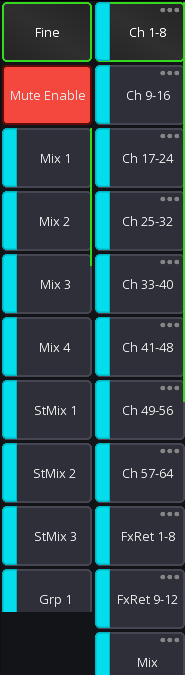

# Sends on faders

Sends on faders allows you to quickly access all sends to a certain mix.
When enabled, all faders will show the level sent to the selected mix, instead of your main mix.

Example:

When pressing "Mix 1" the faders will now show the signal contribution of the channels to "Mix 1" instead of your "Main
LR" mix.

Channels which can't send a signal to the currently selected mix will be hidden.

It is also possible to show the channel gains on the faders (at the very bottom of the list).

## UI Configuration

There are two possible UI modes available:

| SoF list enabled (default)                                                                                                    | SoF list disabled                                                                                                                                                                                     |
|-------------------------------------------------------------------------------------------------------------------------------|-------------------------------------------------------------------------------------------------------------------------------------------------------------------------------------------------------|
|                                                                       |                                                                                                                                                       |
| This is the default UI mode. Here each mix is represented by a button.  Pressing that button will enable sends on fader mode. | In this UI mode all mixes are hidden behind a context menu button. If you press this button you can select the mix.  Additionally, you have to press the `Snd-Fader` button to enable sends on fader. |

## Bus master

The *bus master* is the main channel of the currently selected mix.
If sends on fader is disabled this will correspond to the LR mix, otherwise it the selected mix.

## Gain on faders

At the very end of the sends on fader selection is a `Gain` item. When selected the fader knobs will turn red
and show the current gain of the channel.

## Configuration

It's possible to change the order of the mixes in the list, as well as hide any unused mixes,
see [layer setup](layers.md) for more details.