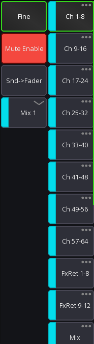

# Sends on faders

"Sends on faders" allows you to quickly access all sends to a certain mix.
When enabled, all faders will show the level sent to the selected bus instead of the LR mix.

It is also possible to show the channel gains on the faders.

There are two possible UI modes available:

| SoF list enabled (default)                               | SoF list disabled                                |
|----------------------------------------------------------|--------------------------------------------------|
|  |  |

## Bus master

The *bus master* is the master channel of the currently selected mix.
If "sends on fader" is disabled this will correspond to the LR mix, otherwise to the selected target mix.

### SoF list

This is the default UI mode. Here each mix is represented by a button.
Pressing that button will enable "sends on fader" mode.

### SoF list disabled

In this UI mode all mixes are hidden behind a context menu button. If you press this button you can select the mix.
Additionally, you have to press the `Snd-Fader` button to enable "sends on fader".

## Gain on faders

At the very end of the "sends on fader" selection is a `Gain` item. When selected the fader knobs will turn red
and show the current gain of the channel.

## Configuration

It's possible to change the order of the items in the list, as well as remove any unused items,
see [layer setup](layers.md) for more details.