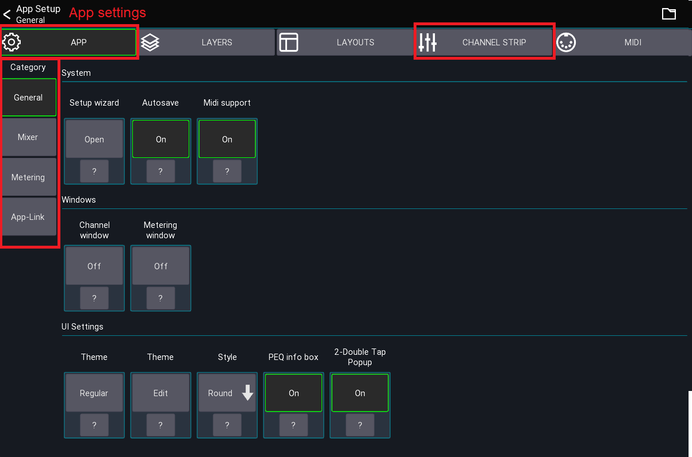
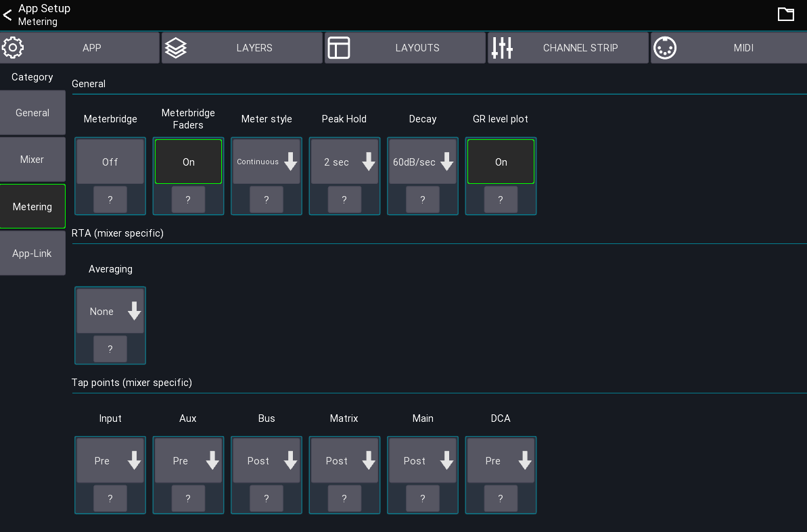

# User / Session settings

This page provides access to all session and user settings

## Open settings

The app settings can be opened via the menu from the *mixer view*

```
Menu -> Setup -> App
```

## App tab


The first tab contains all *app settings*. The different setting categories are displayed to the left.

Press `?` for more details. Some special settings are explained here in more detail.

The [channel strip](channel-strip.md) tab is explained on its dedicated page.

### Setup wizard

Restarts the setup wizard that is shown the first time the app is opened.

### Orientation lock

If supported by the platform, you can lock the orientation of the device. If not available please use the OS mechanism
for locking the screen orientation.

### Autosave

When enabled, this feature automatically saves all `User settings` under the name "default" when leaving any settings
view.

### USB Midi

Enables the USB midi stack. This should only be enabled if you're using this functionality as it consumes more power.

### Windows

> Desktop only

These settings allow you to configure the multi window behaviour of the app.

## Mixer category


These settings are related to the mixer and channel views.

### Global knobs / sliders

This section configures how the knobs and sliders behave. The settings apply to all knobs in the app except sliders in a
channel strip, which are configured in the `Channel Strip` tab.

### {{ abbr('DCA') }} Spill

Enables a Midas Pro style popgroup functionality.
When tapping on a channel button of a DCA/IDCA group, the assigned channels will be shown in the mixer instead of
opening the DCA/group. To edit an DCA/IDCA while popgroup mode is enabled, **press and hold** the channel button.

When selecting an IDCA in popgroup mode, the displayed channels do **not** follow the currently selected sends on fader
selection. Instead the assigned target mix of the IDCA is used.

### Follow Layers

When enabled, the `<-` and `->` buttons in the channel view follow the current layer instead of the default channel
order.

#### Example

With the option enabled, suppose your current layer configuration is as follows:

```
Band
	Ch 1
	Ch 2
	Ch 3
	Ch 5
Vocal
	Ch 11
	Ch 13
	Ch 14
```

If you open `Ch 5` and press `->`, will move to `Ch 11` instead of `Ch 6`.

### {{ abbr('FX') }} Popup

When enabled, shows tap delay buttons in the mutegroup popup.

### {{ abbr('SoF') }} list

When enabled, shows a "sends on fader" list instead of the dropdown menu.

### {{ abbr('RTA') }} Follow

When enabled, the app will always change the RTA source to the currently open channel.
Depending on the mixer this means that the app will change the PAFL selection.

## Metering category


This section is used to configure signal metering and RTA.

### Meterbridge

Shows a meterbridge on top of the mixer. The number of meters per group follows your `visible channels` layer
configuration.

### Peak hold

Defines how long the peak indicator should be shown before resetting.

### Decay

Defines how fast the meter should decay (fall down).

### {{ abbr('GR') }} level plot

Enables a history plot of the dynamics input and gain reduction signal.


### Tap points

Depending on the mixer you can change the signal tap points that should be used for the meters.
If your mixer doesn't support this feature it will not be shown in the app.

## App-Link category

See [app-link](../app-link.md)