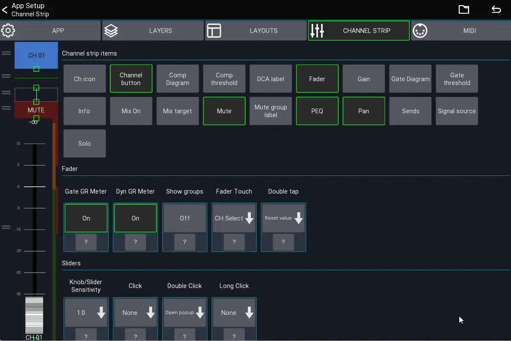

# Channel strip settings

These settings are related to the channel strips in the mixer and belong to the **user settings** (i.e., they apply to all mixers)

## Channel strip items
On the left side of the view you can change the size and position of the channel strip UI elements.
Drag directly on an item to resize it. Drag on the left side of an item to change its position.

## Fader
### Show groups
When enabled, all assigned DCA and Mutegroups will be shown on the right of the fader.

### Fader touch
Defines what should happen if the fader is touched.

### Double tap
Defines what should happen if the fader is double tapped.

## Sliders
This section configures all sliders inside a channel strip (i.e., in the mixer and any other channel strip).

## Behaviour
This section configures the behaviour of the channel strip.

### Highlight channel
If enabled, the currently selected channel is highlighted.

### Fine fader ratio
Changes the sensitivity of the fader when [fine mode](/ui-controls/#fine-mode) is enabled.

### Channel click
Changes the behaviour when tapping a channel button.

### Channel long click
Changes the behaviour when long pressing a channel button.

### Sends click
Defines what happens when a sends slider inside the channel strip is clicked.

### Sends readonly
If enabled, the sends sliders inside the channel strip are read-only (to prevent accidental changes).