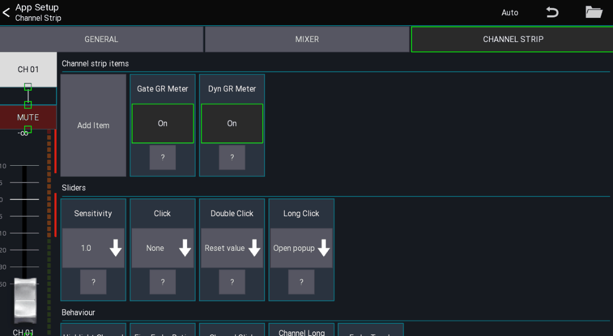

# Channel strip settings

These settings are related to the channel strips in the mixer and belong to the **user settings**

## Items
On the left side of the view you can change the size and position of the channel strip UI elements.
Drag the green rectanges to resize the items. Drag anywhere else to change the position.

You can add new items by using the `Add Item` button. To remove an item simply click or long click on it.

### Touch modes
It is possible to change the touch modes for this setup dialog using the `Auto` button in the top menu:

- Auto: The item will be moved/resized depending on where you touch the icon
- Resize: The item will always resized when dragging
- Move: The item will always be moved when dragging

## Sliders
This section configures all sliders inside a channel strip (e.g. in the mixer and any other channel strip).

## Behaviour
This section configures how the channel strip should behave

### Fine fader ratio
Changes the sensitivity of the fader when [fine mode](/ui-controls/#fine-mode) is enabled

### Channel click
Changes the behavior when taping a channel button

### Channel long click
Changes the behavior when long pressing a channel button

## Channel strip items
In this section you can select what items should be shown in a channel strip