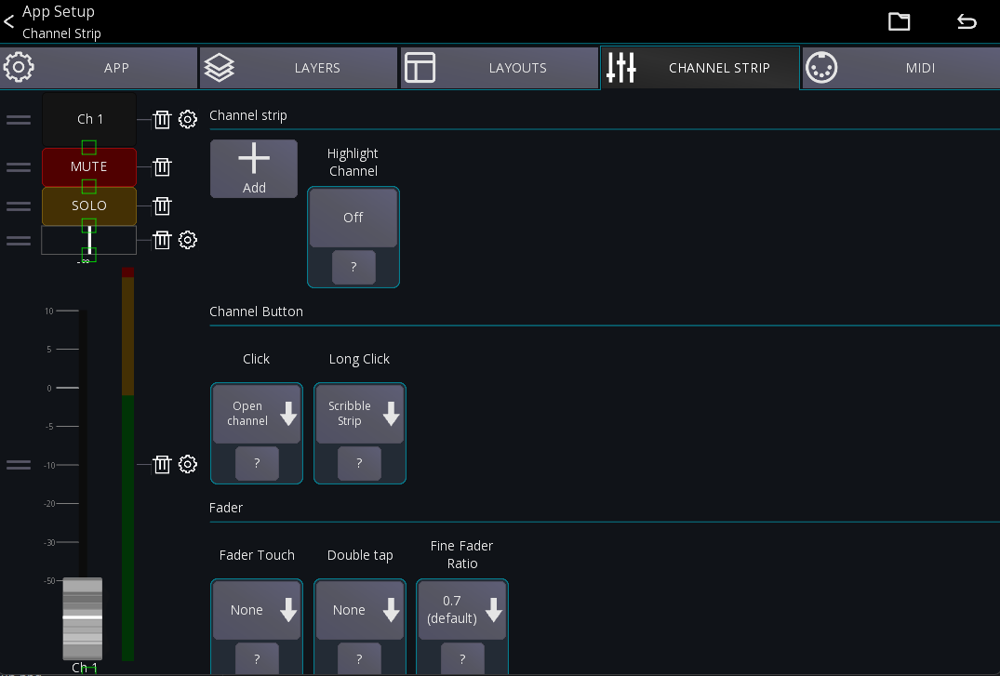
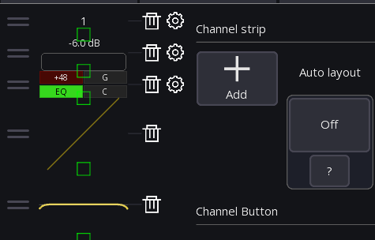
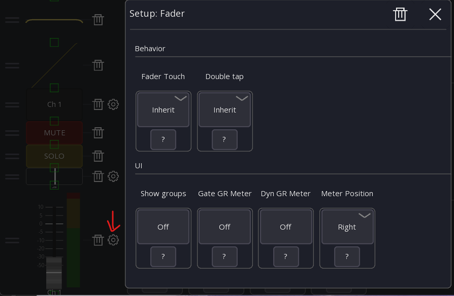

# Channel strip settings

The channel strips can be fully configured to your liking. The configuration is stored globally for your device.

On the left side of the screen you'll see your current channel strip configuration. You can re-arrange items
by dragging them using the indicator on the left. 
To the right of each UI element you'll find a trash and gear icon.
Those can be pressed to either remove or further configure the item.

On the right side of the screen you can find general behavior settings for the channel strip. 

## Layout modes
By default, the `Auto layout` setting is enabled. This mode will automatically show/hide the channel strip items
you have configured on the left, based on the available screen space.

If you want to have full control over the size of the items (for example if you want larger mute buttons) you can 
disable `Auto layout`.
This will result in small rectangles being shown on the channel strip items. You can drag those to resize
the items to your liking:

## Options

The following describes the options available on the right side of the screen
### Channel Strip

### Channel Button

This section configures the [channel button](../ui-controls.md#channel-buttons).

- `Click`:  Configures what should happen if the button is clicked (touch and release)
- `Long Click`:  Configures what should happen if the button is long clicked (touch and hold)

### Fader

This section configures the global fader behavior.

- `Fader Touch`: Configures what should happen if the fader is touched
- `Double tap`: Configures what should happen if the fader knob is double tapped.
- `Fine fader ratio`: Configures the sensitivity of the fader if [fine mode](../ui-controls.md/#fine-mode) is enabled.

Additional fader specific settings can be found when pressing the gear icon to the right of the fader:

- `Show groups`: When enabled, all assigned {{ abbr('DCA') }} and Mutegroups will be shown on the right of the fader.
- `Gate GR meter`: Show the gate gain reduction
- `Gate Dyn meter`: Show the compressor gain reduction
- `Meter position`: Changes the position of the metering

### Sliders

This section configures all sliders inside a channel strip (i.e., in the mixer and any other channel strip).
You can configure the sensitivity of the sliders, and what should happen if they get clicked.

## Behaviour

This section configures the behavior of the channel strip.

- `Highlight channel`: If enabled, the currently selected channel is highlighted.
- `Fine fader ratio`: Changes the sensitivity of the fader when [fine mode](../ui-controls.md/#fine-mode) is enabled.
- `Channel click`: Changes the behavior when taping a channel button.
- `Channel long click`: Changes the behavior when long pressing a channel button.
- `Sends click`: Defines what happens when a sends slider inside the channel strip is clicked.
- `Sends readonly`: If enabled, the sends sliders inside the channel strip are read-only (to prevent accidental
  changes).