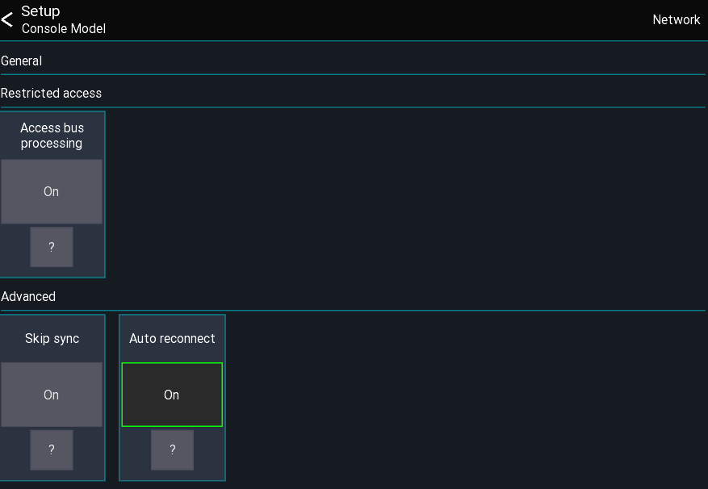

# Console Model settings
This page gives an overview over the available console model settings.

## Open settings
The app settings can be opened via the menu from the `console start view` (directly after selecting a console model)
```
Menu -> Gear icon
```



## Access bus processing
When enabled a user with restricted access to a single bus is allowed to access the processing of that bus.


## Skip sync
> Debugging purposes only

Disables the data sync from the console

## Auto reconnect
When enabled the app will automatically reconnect to the mixer in case of a connection error