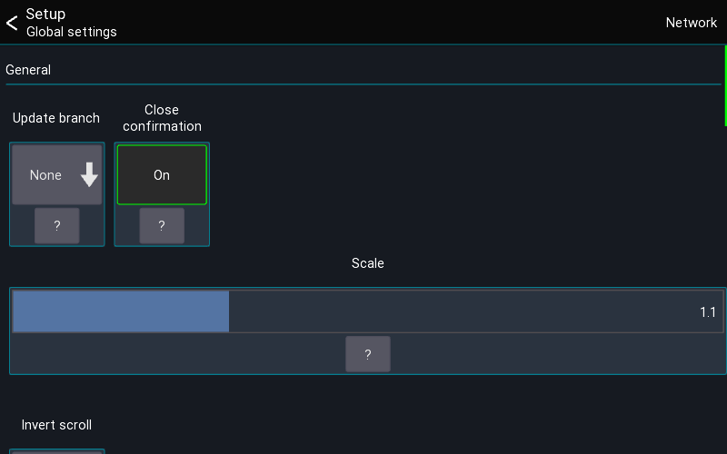

# Global settings
This page gives an overview over the available global settings.

## Open settings
The app settings can be opened via the menu from the `start view` (directly after opening the app)
```
Menu -> Gear icon
```



## Update branch
> PC version only

Configures which branch to use when checking for updates

## Scale
Changes the UI scale of the app.

## Invert scroll
Inverts the mouse / touchpad scroll direction


## Access bus processing
When enabled a user with restricted access to a single bus is allowed to access the processing of that bus.

## Autostart
Autostart allows you to configure to which mixer the app should connect after starting.
This is usefull for installation purposes where the app should always connect to a mixer without user interaction.

## API
Only available on Desktop platform. Lets you enable the API access for Mixing Station. 

## Skip sync
> Debugging purposes only

Disables the data sync from the console

## Auto reconnect
When enabled the app will automatically reconnect to the mixer in case of a connection error


## Network
On the top right you can access the network interface settings.
These settings are for advanced network configurations.