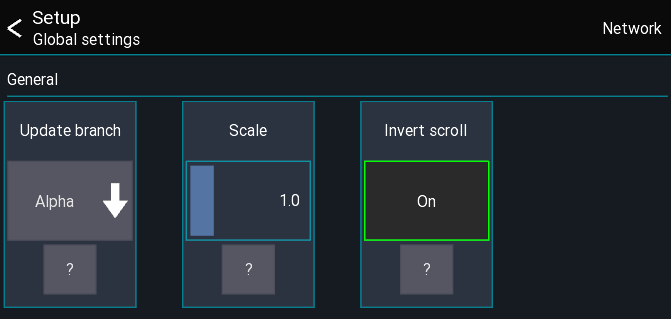

# Global settings
This page gives an overview over the available global settings.

## Open settings
The app settings can be opened via the menu from the `start view` (directly after opening the app)
```
Menu -> Gear icon
```



## Update branch
> PC version only

Configures which branch to use when checking for updates

## Scale
Changes the UI scale of the app.

## Invert scroll
Inverts the mouse / touchpad scroll direction

## Network
On the top right you can access the network interface settings.
These settings are for advanced network configurations.
